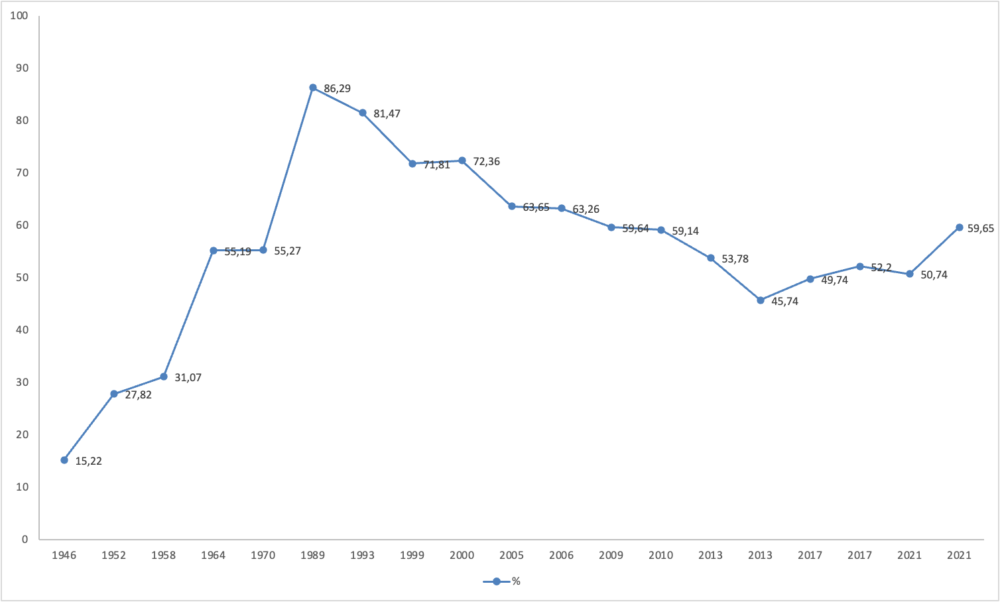

```{r}
#| label: setup
#| include: false
library(knitr)
knitr::opts_chunk$set(#echo = F,
                      warning = F,
                      error = F, 
                      message = F,
                      cache=T) 
```

::: columns
::: {.column width="15%"}

:::

::: {.column .column-right width="85%"}
<br>

## **Sesión: Estrategias de Acción desde un Enfoque Comunitario**

------------------------------------------------------------------------

Daniel Miranda

::: {.blue .medium}
Contacto: danmiranda\@uchile.cl
:::

2025
:::
:::

# Sesiones

## 4 Sesiones

-   Concepciones de ciudadanía y participación

-   La institución escolar como espacio de formación ciudadana

-   Ciudadanía y cambio social

-   Ciudadanía activa: actividades

# Actividad: Parte 1

## Actividad: Parte 1

Trabajo individual colaborativo:

¿Cuándo me he sentido "ciudadano/a"?

¿En qué espacios participo (barrio, escuela/universidad, redes sociales, voluntariado, política formal)?

¿Qué barreras siento para participar?

¿Dónde aprendí lo que se sobre "ser ciudadano"?

# Conceptos relevantes

## Democracia y ciudadanía

-   *"..las monocracias, las autocracias, las dictaduras son fáciles, nos caen encima solas; las democracias son difíciles, tienen que ser promovidas y creídas" (Sartori, 1991, p.118)*.

# Modelo(s) de democracia

## Modelo(s) de democracia: liberal

-   Mínima (voto)
-   Sistema de partidos (número razonable)
-   Ciudadanos autonomos con habilidades y conocimientos básicos
-   Coformidad con reglas y procedimientos

## Modelo(s) de democracia: Republicanismo cívico

-   Ciudadanos activos
-   Activismo político
-   Altos niveles de conocimientos y habilidades
-   Crítica en el nombre del bien común

## Modelo(s) de democracia: Democracia crítica

-   Creando justicia social
-   Activismo social y político
-   Crítica y mejora de la igualdad a travez de la acción política y social

## Modelo(s) de democracia: Democracia cosmopolita

-   Más allá de límites nacionales (global)
-   Interés en los problemas del mundo
-   Celebración de la diversidad

# Actividad: Parte 2

## Actividad: Parte 2

Trabajo grupal:

Construya un mapa de ciudadanía experimentada, organizando sus experiencias en relación a los modelos vistos:

-   Liberal (derechos y deberes formales).

-   Republicano (participación en lo público).

-   Crítico (transformación social, cuestionamiento del poder).

-   Cosmopolitano (globalismo, limites estado-nación difusos )

## Algunas preguntas

¿Qué diferencias hay entre las formas de ciudadanía que vivimos y las concepciones teóricas?

¿Qué aprendizajes nos deja pensar la ciudadanía desde lo comunitario y no solo desde lo individual?

¿Cómo influyen nuestros contextos (familia, escuela, barrio) en la forma en que entendemos la participación?

# Modelo(s) de ciudadanía: ¿Crisis o nuevas ciudadanías?

## Modelos posibles

-   "participation in civil society, community and/or political life, characterized by mutual respect and non-violence and in accordance with human rights and democracy" (2006¸ pp. 4).

-   Sociedad civil

-   Comunidad

-   Vida política

-   Respeto mutuo

-   no violencia

-   derechos humanos

-   democracia

## Modelo(s) de ciudadanía

{fig-align="center" width="50%"}

## Modelo(s) de ciudadanía

{fig-align="center" width="80%"}

## Modelo(s) de ciudadanía

{fig-align="center"}

## Modelo(s) de ciudadanía

{fig-align="center" width="60%"}

## Modelo(s) de ciudadanía

{fig-align="center" width="80%"}

## Modelo(s) de ciudadanía

{fig-align="center"}

# Jóvenes y participación

## Jóvenes y participación

-   Participación: Cambio (proliferación) de los repertorios de participación (Van deth, 2001)

{fig-align="center" width="45%"}

## Jóvenes y participación

-   Paradoja de la participación, sobre todo en cohortes más jóvenes

-   Disminución de la participación en voto como amenaza a la representatividad de los sistemas democráticos (Blais & Rubenson, 2013).

## Jóvenes y participación



## Jóvenes y participación

-   Desigualad política: otra amenaza.

-   Desigualdad social y su relación con desigualdad política

-   Aumento de las desigualdades sociales (Picketty, 2014; GINI project, 2012).

-   Los efectos de los sesgo socieconómicos se observan desde edades tempranas, indicando desigualdad política desde el inicio (Verba, Burns & Schlozman, 2003; 2015)

-   Estos sesgos socioeconómicos serían una amenaza importante a los ideales democráticos de igualdad en la participación y representación.

## Jóvenes y participación

-   Sin embargo, al considerar otras formas de participación los patrones sugieren que las cohortes jóvenes prefieren canales alternativos (o no institucionales) de participación (García-Albacete, 2014).

{fig-align="center"}

## Jóvenes y participación

{fig-align="center"}

## Jóvenes y participación

{fig-align="center" width="90%"}

## Jóvenes y participación

{fig-align="center"}

## Jóvenes y participación

{fig-align="center"}

## Jóvenes y participación

{fig-align="center" width="80%"}

## Jóvenes y participación

{fig-align="center"}

# Estudios Nacionales e Internacionales

## Estudios Nacionales e Internacionales

-   IEA Civic Education Study, CIVED 1999. Australia, Belgium (French), Bulgaria, Canada, Chile, Colombia, Cyprus, Czech Republic, Denmark, England, Estonia, Finland, Germany, Greece, Hong Kong SAR, Hungary, Israel, Italy, Latvia, Lithuania, Netherlands, Norway, Poland, Portugal, Romania, Russian Federation, Slovak Republic, Slovenia, Sweden, Switzerland, and United States.

## Estudios Nacionales e Internacionales

-   International Civic and Citizenship Education Study, ICCS 2009


## Estudios Nacionales e Internacionales

-   International Civic and Citizenship Education Study, ICCS 2016: Belgium (Flemish), Bulgaria, Chile, Chinese Taipei, Colombia, Croatia, Denmark, Dominican Republic, Estonia, Finland, Germany (North Rhine-Westphalia), Hong Kong SAR, Italy, Korea, Latvia, Lithuania, Malta, Mexico, Netherlands, Norway, Peru, Russian Federation, Slovenia, and Sweden.

-   CELS: The Citizenship Educational Longitudinal Study - 2001-2010 [Link](https://www.nfer.ac.uk/research/projects/cels/)

## Estudios Nacionales e Internacionales

-   Estudio Panel Sueco. Desde 2009: 5000 adolescentes y adultos jóvenes entre 13-30 por un periodo de 6 años. \\url{https://www.oru.se/PSP/

-   Belgian Political Panel Survey (BPPS), 2006-2011. 6000 adolescentes [Link](https://lirias.kuleuven.be/handle/123456789/314889)

-   Estudio de Educación Cívica 2017. Agencia de la Calidad de Educación. [Link](https://www-iea-nl.translate.goog/studies/iea/iccs/2027?_x_tr_sl=en&_x_tr_tl=es&_x_tr_hl=es&_x_tr_pto=tc)

-   Panel Chileno de Socialización Política, 2019-2021. 1500 jóvenes, familias y profesores.

## Algunos resultados


## Algunos resultados


## Algunos resultados


## Algunos resultados


## Algunos resultados


## Algunos resultados


## Algunos resultados


## Algunos resultados


## Algunos resultados


## Algunos resultados


## Algunos resultados

{width="80%"}

## Algunos resultados

{width="80%"}

## Algunos resultados

{width="80%"}

## Algunos resultados

{width="80%"}

## Por lo tanto

-   Por tanto, capturar las diversas formas de expresión de la ciudadanía parece adecuado para abordar esta problemática.

-   Considerando que en población juvenil la pregunta por la participación se convierte en una pregunta acerca del funcionamiento futuro de la democracia (Van Deth, 2011).

-   Sin embargo, votar y las manifestaciones públicas no son suficientes para cubrir todos los aspectos necesarios.

-   ¿Qué queda por cubrir?

# Rol de la escuela

## Rol de la escuela

-   Socialización política: Entender el proceso por medio del cuál las personas de encuentran su lugar en el sistema político es (y han sido) un tema de preocupación (Tockeville; Niemi & Hepburn, 1995; Greenstein, 1965; Hyman, 1969; Langton, 1969; Abendschon, 2013; Ekman & Amna, 2014)

-   Supuesto: Lo que se aprende en edades tempranas tiende a permanencer: persistencia de la socializaciión (Hooghe, 2004)

-   Agentes de socialización: Familia, escuela, pares, medios, instituciones.

-   La escuela...

## Ideales

Los sistemas escolares nacen atados a dos ideales normativos (Peña, 2014)

-   Meritocracia: escuela como ecualizador de las condiciones de origen social

-   Ciudadanía: separación de la incondicionalidad del hogar, permitiría la adquisicion de virtudes y valores necesarios para la vida democrática.

-   ¿Puede la escuela fortalecer esos ideales?

## Formación Ciudadana en Chile

{fig-align="center" width="50%"}

## Formación Ciudadana en Chile

-   "La educación cívica debe constituir una de las principales materias del programa escolar. La democracia gana terreno en el mundo entero. La libertad y la igualdad se establecen así en las Monarquías como en las Repúblicas...

-   ...Si los ciudadanos no saben distinguir las reglas más elementalesde justicia, de buena administración y de previsión que un país debe observar en interés de su conservación y prosperidad; si se imaginan mejorar su suerte por medio de la expoliación o la violencia, entonces el gobierno popular no haría otra cosa que cavar la tumba a la libertad.

## Formación Ciudadana en Chile

-   El sufragio es el pedestal del gobierno democrático; es menester esforzarse en interés de las instituciones es republicanas, por esparcir la capacidad política en la inteligencia de la instrucción cívica, sólida y general debe siempre preceder al sufragio universal" (p.1).

## Formación Ciudadana en Chile

-   El curriculum de Educación Ciudadana, Desde el 80 hasta ahora, ha sido redefinido 4 veces (Cox & García, 2014)

-   1980-1981: Centrado en la familia y valores nacionalistas.

-   Con un curso de educación Cívica en los dos últimos años, con foco en constitución y democracia portegida.

-   1996 para Básica y 1998 en Media: Reorganiza la formación en diversas asignaturas.

-   Historia y ciencias sociales, orientación, Filosofía y Psicología.

## Formación Ciudadana en Chile

-   Ajuste curricular 2009: Enfásis e contenidos como: Intitucionalidad política y compromiso ciudadano.

    -   Se mantiene distribuido.

    -   Ajuste curricular 2013: se explicita eje de formación ciudadana:

    -   En Historia, geografía y ciencas sociales desde 1ro básico a 2do Medio.

## Plan de Formación Ciudadana 2016

{width="80%"}

## Plan

-   La ley Nº 20.911 dispone que todos los establecimientos educacionales reconocidos por el Estado deberán incluir en los niveles educativos que impartan --parvularia, básica y/o media--- un Plan de Formación Ciudadana, que integre y complemente las definiciones curriculares nacionales para brindar a las y los estudiantes la preparación necesaria en este ámbito.

-   El Ministerio de Educación propone que este Plan se articule con el Proyecto Educativo Institucional (PEI) y con el Plan de Mejoramiento Educativo (PME).

-   Se espera que el plan brinde a los estudiantes la preparación necesaria para asumir una vida responsable en una sociedad libre y de orientación hacia el mejoramiento integral de la persona humana, como fundamento del sistema democrático, la justicia social y el progreso. Asimismo, deberá propender a la formación de ciudadanos, con valores y conocimientos para fomentar el desarrollo del país, con una visión del mundo centrada en el ser humano, como parte de un entorno natural y social.

## Objetivos del Plan

-   Promover la comprensión y análisis del concepto de ciudadaníay los derechos y deberes asociados a ella, entendidos éstos en el marco de una República democrática, con el propósito de formar una ciudadanía activaen el ejercicio y cumplimiento de estos derechos y deberes.

-   Fomentar en las y los estudiantes el ejercicio de una ciudadanía crítica, responsable, respetuosa, abierta y creativa.

-   Promover el conocimiento, comprensión y análisis del Estado de Derecho y de la institucionalidad local, regional y nacional, y la formación de virtudes cívicas en el estudiantado.

## Objetivos del Plan

-   Promover el conocimiento, comprensión y compromiso de los y las estudiantes con los derechos humanos reconocidos en la Constitución Política de la República y en los tratados internacionales suscritos y ratificados por Chile, con especial énfasis en los derechos del niño.

-   Fomentar en los y las estudiantes la valoración de la diversidad social y cultural del país.

-   Fomentar la participación del estudiantado en temas de interés público.

## Objetivos del Plan

-   Garantizar el desarrollo de una cultura democrática y ética en la escuela.

-   Fomentar una cultura de la transparencia y la probidad.

-   Fomentar en los estudiantes la tolerancia y el pluralismo.

¿Qué modelo de ciudadano y democracia contiene el plan?

## Un estudio en desarrollo


## Un estudio en desarrollo


## Un estudio en desarrollo


## Un estudio en desarrollo

-   Comprender los procesos de influencia de la familia y la escuela sobre el compromiso cívico de los estudiantes, independientes y combinados.

-   Evaluar en qué medida los efectos familiares (medidos a través de la participación de los padres en la escuela, los antecedentes socioeconómicos y socioculturales) y los estilos de clima escolar (democrático, permisivo, autoritario e indiferente) promueven el compromiso cívico de los estudiantes.

-   Evaluar en qué medida los efectos familiares y los estilos de clima escolar interactúan para promover compromiso cívico de los estudiantes.

## Un estudio en desarrollo

{width="70%"}

## Algunas evidencias

::: columns
::: {.column width="50%"}
{fig-align="center" width="50%"}
:::

::: {.column width="50%"}

:::
:::

# Rol de la familia

## Rol de la familia

{fig-align="center"}

## Rol de la familia

{fig-align="center"}


# Relación entre Psicología Comunitaria (PC) y Psicología Política (PP)


## **Pregunta guía:**

**¿Cómo dialogan PC y PP para comprender y transformar fenómenos colectivos?**


## Punto de partida: Montero (2010)

- Montero propone el **fortalecimiento de la ciudadanía** y la **transformación social** como área de encuentro entre PC y PP [@montero2010].

Aportes clave desde PC hacia PP:

  1) **Ética y perspectiva liberadora** (Freire, Martín-Baró).  
  2) **Participación–compromiso** como acción política.  
  3) **Metodologías compartidas**: IAP, relatos/historias de vida, narrativas comunitarias, métodos mixtos.  
  4) Trabajo con **políticas públicas** y actores intermedios.


## Contexto histórico (muy breve)

::: columns
::: column
### Psicología Comunitaria (PC)
- Surge en AL como crítica a la psicología social tradicional.
- **Foco:** transformación de condiciones de vida, hábitat, vínculos.
- **Praxis** con comunidades; centralidad de participación y compromiso [@montero2010].
:::

::: column
### Psicología Política (PP)
- Tradición más amplia: actitudes, liderazgo, poder, participación.
- En AL: énfasis **crítico e histórico**; atención a estructuras e instituciones [@montero2010].
:::
:::


## Convergencia 1: Transformación social

- La transformación es **proceso** (no un estado final).  
- Supone variación constante y logros parciales que abren nuevos desafíos [@montero2010].  
- **PC:** cambiar condiciones locales y subjetividades.  
- **PP:** vincular transformaciones con ciudadanía, legitimidad e instituciones.


## Convergencia 2: Poder (visión simétrica)

- Desde PC latinoamericana: **poder como relación** (no solo posesión).  
- **Perspectiva simétrica**: todos los actores tienen algún poder, aunque **recursos sean desiguales** → abre vías de **negociación, concertación y oposición** [@montero2010].
- Implicación para PP: mejor comprensión de **resistencia** y **estrategias** en contextos de asimetría.

## Convergencia 3: Fortalecimiento (empowerment)

- En AL: se trabajó como **fortalecimiento** antes que “empoderamiento”.  
- **Definición operativa**: proceso mediante el cual comunidades **desarrollan capacidades y recursos** para **controlar** su situación de vida y **transformarla** con **participación y compromiso** [@montero2010].  
- Conecta con **formación de ciudadanía crítica**.

## Aportes de PC a PP (síntesis)

1. **Ética y liberación**: concientización, justicia social (Freire; Martín-Baró) [@montero2010].  
2. **Participación–compromiso**: la acción comunitaria **es** acción política.  
3. **Metodologías**:  
   - **IAP** (Participación en todas las fases).  
   - **Biográfico–discursivo**: historias de vida, narrativas comunitarias.  
   - **Mixtos**: combinación creativa de cualitativo/cuantitativo (p. ej., “experimentos participativos cualitativos”).  
4. **Políticas públicas**: articulación **comunidad–técnicos–Estado** y sensibilización de actores intermedios [@montero2010].


## Tensiones frecuentes

- **Escala y foco**  
  - PC: intervención **local** y fortalecimiento organizacional.  
  - PP: análisis **institucional–sistémico**.  
- **Riesgos**  
  - PC: **despolitización** si se diluye el enfoque crítico.  
  - PP: **individualización** excesiva de fenómenos políticos [@montero2010].

---

## Caso 1 (CHL): procesos participativos locales

**Ejemplos:** cabildos, presupuestos participativos, mesas territoriales.  
- **PC**: inclusión de grupos marginados, capital social, identidad y sentido de comunidad.  
- **PP**: efectos en **legitimidad**, agenda pública y **calidad democrática**.

> **Discusión breve:** ¿Qué indicadores usarías para evaluar **fortalecimiento** y **calidad democrática** en este tipo de procesos?


## Psicología Comunitaria y Psicología Política

**Idea fuerza:** PC y PP se encuentran en la **construcción de ciudadanía** y la **transformación social**.  
- PC aporta **praxis**, **participación** y **ética liberadora**.  
- PP aporta **análisis estructural**, **institucional** y **estrategias**.

> **Pregunta final:** ¿Qué ganaríamos al diseñar **intervenciones** que integren simultáneamente métricas de **fortalecimiento comunitario** y de **calidad democrática**?

## Psicología Comunitaria y Psicología Política

- La Psicología Comunitaria aporta **praxis, participación y fortalecimiento**.  

- La Psicología Política aporta **análisis estructural, poder e institucionalidad**.  

- Ambas convergen en la **promoción de ciudadanía activa** y en la búsqueda de sociedades más democráticas y justas.  

> “La acción comunitaria es también acción política” – Montero (2010).


## Algunas bajadas

- Las comunidades enfrentan **problemas diversos**:  
  - Instalación de proyectos comerciales o fábricas.  
  - Falta de áreas verdes comunes.  
  - Problemas de seguridad barrial.  

- Pregunta central:  
  **¿Cómo promover ciudadanía activa en democracia desde la Psicología Comunitaria y la Psicología Política?**


## Psicología Comunitaria: Claves conceptuales

- **Transformación social**: la intervención comunitaria busca modificar condiciones de vida

- **Fortalecimiento (empowerment/fortalecimiento)**: desarrollo de capacidades colectivas para controlar la situación de vida.  

- **Participación–compromiso**: acción conjunta, corresponsabilidad en la toma de decisiones.

- **Metodologías**: investigación-acción participativa (IAP), narrativas comunitarias, talleres de concientización.  


## Psicología Política: Claves conceptuales

- **Ciudadanía activa**: ejercicio de derechos + responsabilidad colectiva. 

- **Poder y legitimidad**: cómo se negocia el acceso a recursos y decisiones. 

- **Instituciones y democracia**: vínculo entre demandas comunitarias y sistemas políticos. 

- **Herramientas analíticas**: estudios de actitudes políticas, análisis de participación electoral y no electoral, marcos de incidencia.  

## Ejemplo 1: Proyecto comercial

- **Situación**: instalación de un gran centro comercial en la periferia.  

- **PC:**  
  - Diagnóstico participativo con vecinos.  
  - Identificación de impactos (tránsito, áreas verdes, empleo).  
  - Fortalecer redes barriales para negociar condiciones.  

- **PP:**  
  - Analizar relación con municipalidad y políticas urbanísticas.  
  - Examinar cómo incide en legitimidad de autoridades locales.  
  - Estrategias de incidencia política (cabildos, audiencias públicas).  


## Ejemplo 2: Instalación de fábrica

- **Situación**: empresa propone planta en sector residencial.  

- **PC:**  
  - Fortalecimiento de organizaciones comunitarias.  
  - Promoción de conciencia ambiental y sanitaria.  
  - Uso de narrativas comunitarias para visibilizar riesgos.  

- **PP:**  
  - Discusión sobre poder económico vs. poder ciudadano.  
  - Canales institucionales: licencias, consultas ambientales.  
  - Análisis de coaliciones políticas y movimientos sociales.  


## Ejemplo 3: Áreas verdes comunes

- **Situación**: barrio exige construcción de parque comunitario.  

- **PC:**  
  - Diagnóstico de necesidades con niños, familias, adultos mayores.  
  - Diseño participativo del espacio.  
  - Activación del sentido de comunidad.  

- **PP:**  
  - Políticas municipales sobre espacios públicos.  
  - Relación entre calidad de vida y ciudadanía activa.  
  - Estrategias de presión política para priorizar presupuesto.  


## Ejemplo 4: Seguridad barrial

- **Situación**: aumento de delitos en la zona.  

- **PC:**  
  - Promoción de redes de apoyo vecinales.  
  - Talleres de confianza y cohesión social.  
  - Co-construcción de soluciones con vecinos y actores locales.  

- **PP:**  
  - Análisis del discurso político sobre seguridad.  
  - Participación comunitaria en consejos de seguridad ciudadana.  
  - Relación entre miedo, participación y democracia.  


## Claves prácticas para la ciudadanía activa

1. **Diagnóstico participativo**: escuchar y reconocer necesidades sentidas.

2. **Fortalecimiento comunitario**: desarrollo de capacidades colectivas. 

3. **Participación real**: voz, voto y veto de la comunidad en decisiones.  

4. **Incidencia política**: traducir demandas comunitarias en propuestas institucionales. 

5. **Ética y liberación**: concientización crítica frente a desigualdad y exclusión.  


## Experiencias en otras partes del mundo 

- Identificar a los partner correctos: buenos partnert ayudan a una mejor comprensión del contexto local y cultural (ONGs, organizaciones locales, individuos, académicos, entro otros)

- Realizar con un análisis de poder: desarrollar el “poder interno” (confianza y autoestima) y luego el “poder con” (organización colectiva).

- Teoría del cambio: ¿cómo se espera que las acciones produzcan el cambio?

- Construir “granos de cambio”: grupos locales duraderos (comités, asociaciones, clubes) que sostienen la acción más allá de la protesta puntual.


## Experiencias en otras partes del mundo 

- Formar alianzas amplias e inesperadas: trabajar incluso con “aliados improbables” (empresas, líderes religiosos, partidos).

- La importancia de individuos clave: agentes de cambio visibles y actores con “poder oculto” (influencia tras bambalinas).


- Valorar los “quick wins”: pequeñas victorias que fortalecen la confianza de la comunidad.

## Experiencias en otras partes del mundo 

- Aprovechar ventanas de oportunidad: shocks políticos, ambientales o sociales que abren espacios de cambio.

- Trabajo con el Estado: la ciudadanía activa requiere interacción crítica y constructiva con instituciones para exigir derechos y servicios.

- Tiempo largo: los procesos comunitarios requieren inversión sostenida, paciencia y continuidad.


# Actividad

## Actividad

Caso: Construcción de una Planta de Tratamiento de Residuos en la Comuna “Nueva Esperanza”

Contexto:
Una empresa multinacional propone instalar una planta de tratamiento de residuos en la periferia de la comuna “Nueva Esperanza”.

La promesa: inversión de USD 20 millones, generación de 200 empleos directos y mejora de la infraestructura vial.

El problema: la planta estaría cerca de un barrio residencial y un río utilizado por la comunidad.

El municipio está a cargo de la autorización y de articular con la comunidad y la empresa.

## Roles

Grupo A: Comunidad organizada Integrada por vecinos/as, organizaciones ambientales y juntas de vecinos.

Grupo B: Empresa multinacional. Corporación interesada en instalar la planta, con un discurso de “responsabilidad social”.

Grupo C: Autoridad local (Municipio). Representada por el alcalde/la alcaldesa y concejales.


## Paso 1: Identifique recursos e intereses

¿Qué recursos tienen disponible y qué intereses mueven a cada grupo?


## Grupo A: Comunidad

Recursos a su disposición:

- Movilización social (marchas, cabildos, redes sociales).

- Legitimidad moral: “defensa del agua y la salud”.

- Conexiones con ONGs ambientales y universidades locales.

Intereses:

- Evitar riesgos para la salud y el ambiente.

- Proteger el barrio y el río.

- Garantizar participación real en la toma de decisiones.


## Grupo B: Empresa

Recursos a su disposición:

- Capital financiero (empleos, obras de infraestructura, inversión en la comuna).

- Lobby político y mediático.

- Capacidad técnica para justificar “seguridad” del proyecto.

Intereses:

- Conseguir permisos rápidamente.

- Proyectar imagen positiva como empresa sustentable.

- Minimizar costos de mitigación ambiental.


## Grupo C: Municipio

Recursos a su disposición:

- Legitimidad institucional (otorgar o negar permisos).

- Capacidad de articular mesas de diálogo.

- Acceso a fondos públicos y normativas urbanísticas.

Intereses:

- Mantener estabilidad política y apoyo electoral.

- Promover desarrollo económico local.

- Evitar conflictos sociales prolongados.


## Paso 2: Interacción

Mesa de dialogo:

La empresa propone el proyecto.

La comunidad reacciona.

La autoridad media.


## Paso 3: Dinámica de  negociación

Se firma un “acta simbólica” con acuerdos o desacuerdos:

- ¿Se aprueba el proyecto? ¿Con condiciones?

- ¿Qué compromisos asumen las partes?

- ¿Qué tensiones quedaron sin resolver?


## Paso 4: reflexiones

¿Cómo se ejerció el poder en la negociación?

¿Qué recursos pesaron más (capital financiero, legitimidad, capacidad de movilización)?

¿Hubo espacio para un fortalecimiento ciudadano o se impuso una lógica vertical?

¿Qué aprendizajes deja para pensar la promoción de ciudadanía activa en democracia?


##

::: columns
::: {.column width="15%"}

:::

::: {.column .column-right width="85%"}
<br>

## **Sesión: Estrategias de Acción desde un Enfoque Comunitario**

------------------------------------------------------------------------

Daniel Miranda

::: {.blue .medium}
Contacto: danmiranda\@uchile.cl
:::

2025
:::
:::
