```{r}
#| label: setup
#| include: false
library(knitr)
knitr::opts_chunk$set(#echo = F,
                      warning = F,
                      error = F, 
                      message = F,
                      cache=T) 
```

::: columns
::: {.column width="15%"}


1240922
:::

::: {.column .column-right width="85%"}
<br>

## **Socialización política juvenil: participación, creencias, actitudes y conocimiento**

------------------------------------------------------------------------

Daniel Miranda

::: {.blue .medium}
Contacto: danmiranda\@uchile.cl
:::

2025
:::
:::

# Contenidos

## Contenidos

-   Marco de investigación
-   Conceptos relevantes
-   Rol de la familia
-   Rol de la escuela
-   Estudios nacionales e Internacionales

# Marco de la Investigación

## Proyecto 1240922

Título: Actitudes y comportamiento político juvenil: desigualdad, estilos de socialización escolar e influencias intergeneracionales

FONDECYT regular 1240922

Periodo: 2024-2028

Equipo: Paula Luengo-Kanacri (UC), Felipe Sanchez-Barría (UC), Nicolás Angelcos (UChile), Yonatan Encina (UTalca), Daniel Miranda (UChile).

## Objetivos

Objetivo general:

Describir y examinar distintos procesos de socialización política a nivel familiar-escolar y cómo estos influyen en el desarrollo de las actitudes y comportamiento político.

Objetivos específicos:

• Describir la estabilidad o cambios de la influencia de procesos de socialización política familiar sobre distintos tipos de comportamiento y actitudes políticas de los jóvenes a lo largo de la enseñanza media.

## Objetivos

Objetivos específicos:

• Describir y examinar la influencia de características sociopolíticas de los jóvenes sobre el comportamiento y actitudes políticas de sus padres/madres/cuidadores-as.

• Describir los estilos de socialización política a nivel familiar y escolar examinando su influencia sobre distintos tipos de comportamientos políticos de los jóvenes.

• Describir y examinar las diferencias en los procesos de socialización política familiar y escolar, según distintas condiciones socioeconómicas.

## Modelo general


# Conceptos relevantes

## Democracia y ciudadanía

-   *"..las monocracias, las autocracias, las dictaduras son fáciles, nos caen encima solas; las democracias son difíciles, tienen que ser promovidas y creídas" (Sartori, 1991, p.118)*.

# Modelo(s) de democracia

## Modelo(s) de democracia: liberal

-   Mínima (voto)
-   Sistema de partidos (número razonable)
-   Ciudadanos autonomos con habilidades y conocimientos básicos
-   Coformidad con reglas y procedimientos

## Modelo(s) de democracia: Republicanismo cívico

-   Ciudadanos activos
-   Activismo político
-   Altos niveles de conocimientos y habilidades
-   Crítica en el nombre del bien común

## Modelo(s) de democracia: Democracia crítica

-   Creando justicia social
-   Activismo social y político
-   Crítica y mejora de la igualdad a travez de la acción política y social

## Modelo(s) de democracia: Democracia cosmopolita

-   Más allá de límites nacionales (global)
-   Interés en los problemas del mundo
-   Celebración de la diversidad

# Modelo(s) de ciudadanía: ¿Crisis o nuevas ciudadanías?

## Modelos posibles

-   "participation in civil society, community and/or political life, characterized by mutual respect and non-violence and in accordance with human rights and democracy" (2006¸ pp. 4).

-   Sociedad civil

-   Comunidad

-   Vida política

-   Respeto mutuo

-   no violencia

-   derechos humanos

-   democracia

## Modelo(s) de ciudadanía

{fig-align="center" width="50%"}

## Modelo(s) de ciudadanía

{fig-align="center" width="80%"}

## Modelo(s) de ciudadanía

{fig-align="center"}

## Modelo(s) de ciudadanía

{fig-align="center"}

## Modelo(s) de ciudadanía

{fig-align="center"}

## Modelo(s) de ciudadanía

{fig-align="center"}

# Jóvenes y participación

## Jóvenes y participación

-   Participación: Cambio (proliferación) de los repertorios de participación (Van deth, 2001)

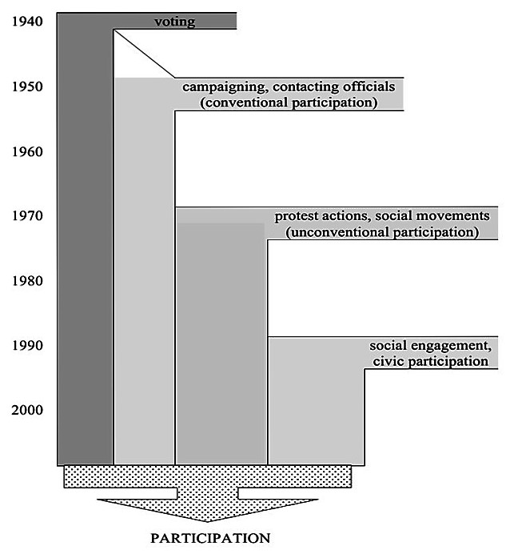{fig-align="center" width="80%"}

## Jóvenes y participación

-   Paradoja de la participación, sobre todo en cohortes más jóvenes

-   Disminución de la participación en voto como amenaza a la representatividad de los sistemas democráticos (Blais & Rubenson, 2013).

## Jóvenes y participación

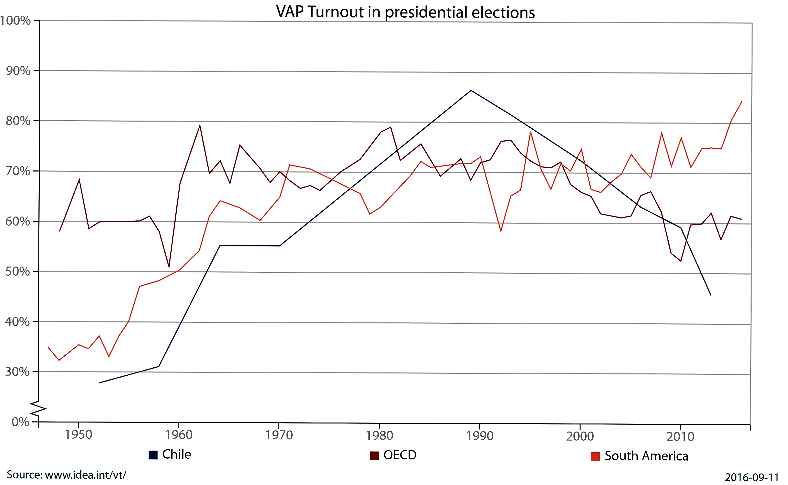{fig-align="center"}

## Jóvenes y participación

-   Desigualad política: otra amenaza.

-   Desigualdad Social y su relación con desigualdad política

-   Aumento de las desigualdades sociales (Picketty, 2014; GINI project, 2012).

-   Los efectos de los sesgo socieconómicos se observan desde edades tempranas, indicando desigualdad política desde el inicio (Verba, Burns & Schlozman, 2003; 2015)

-   Estos sesgos socioeconómicos serían una amenaza importante a los ideales democráticos de igualdad en la participación y representación.

## Jóvenes y participación

-   Sin embargo, al considerar otras formas de participación los patrones sugieren que las cohortes jóvenes prefieren canales alternativos (o no institucionales) de participación (García-Albacete, 2014).

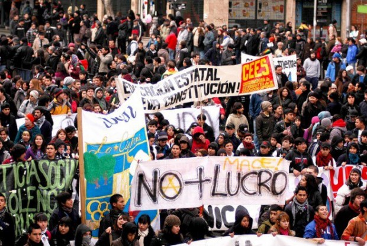{fig-align="center"}

## Jóvenes y participación

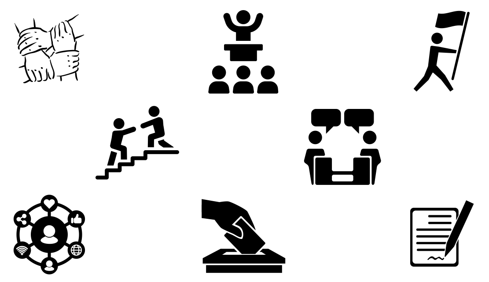{fig-align="center"}

## Jóvenes y participación

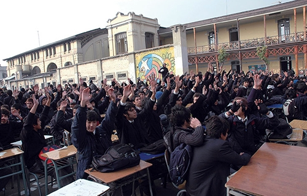{fig-align="center" width="90%"}

## Jóvenes y participación

{fig-align="center"}

## Jóvenes y participación

{fig-align="center"}

## Jóvenes y participación

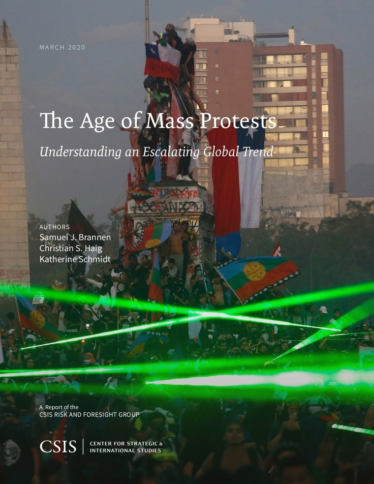{fig-align="center" width="80%"}

## Jóvenes y participación

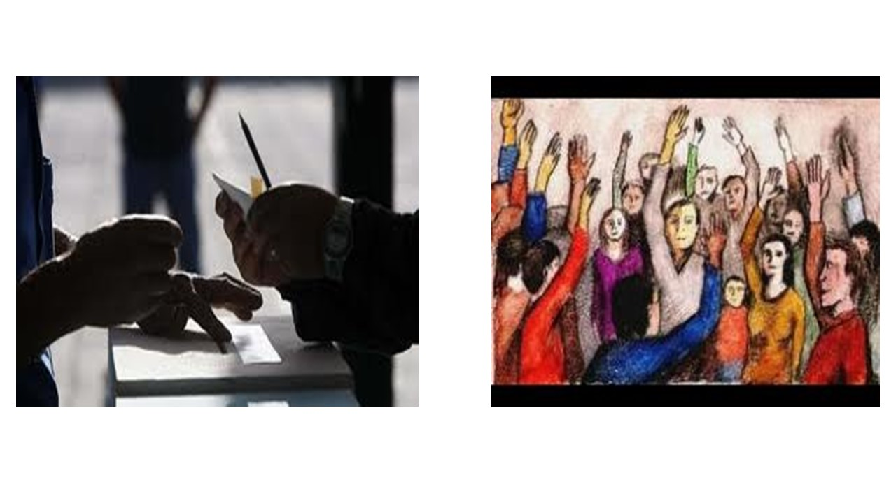{fig-align="center"}

## Por lo tanto

-   Por tanto, capturar las diversas formas de expresión de la ciudadanía parece adecuado para abordar esta problemática.

-   Considerando que en población juvenil la pregunta por la participación se convierte en una pregunta acerca del funcionamiento futuro de la democracia (Van Deth, 2011).

-   Sin embargo, votar y las manifestaciones públicas no son suficientes para cubrir todos los aspectos necesarios.

-   ¿Qué queda por cubrir?

# Rol de la familia

## Rol de la familia

{fig-align="center"}

## Rol de la familia

{fig-align="center"}

# Rol de la escuela

## Rol de la escuela

-   Socialización política: Entender el proceso por medio del cuál las personas de encuentran su lugar en el sistema político es (y han sido) un tema de preocupación (Tockeville; Niemi & Hepburn, 1995; Greenstein, 1965; Hyman, 1969; Langton, 1969; Abendschon, 2013; Ekman & Amna, 2014)

-   Supuesto: Lo que se aprende en edades tempranas tiende a permanencer: persistencia de la socializaciión (Hooghe, 2004)

-   Agentes de socialización: Familia, escuela, pares, medios, instituciones.

-   La escuela...

## Ideales

Los sistemas escolares nacen atados a dos ideales normativos (Peña, 2014)

-   Meritocracia: escuela como ecualizador de las condiciones de origen social

-   Ciudadanía: separación de la incondicionalidad del hogar, permitiría la adquisicion de virtudes y valores necesarios para la vida democrática.

-   ¿Puede la escuela fortalecer esos ideales?

## Algunas evidencias

::: columns
::: {.column width="50%"}
{fig-align="center" width="50%"}
:::

::: {.column width="50%"}

:::
:::

## Un estudio en desarrollo

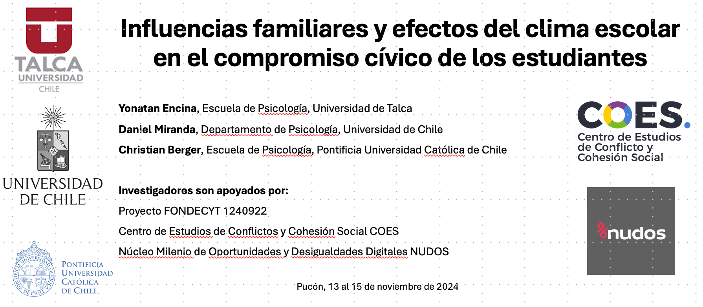

## Un estudio en desarrollo

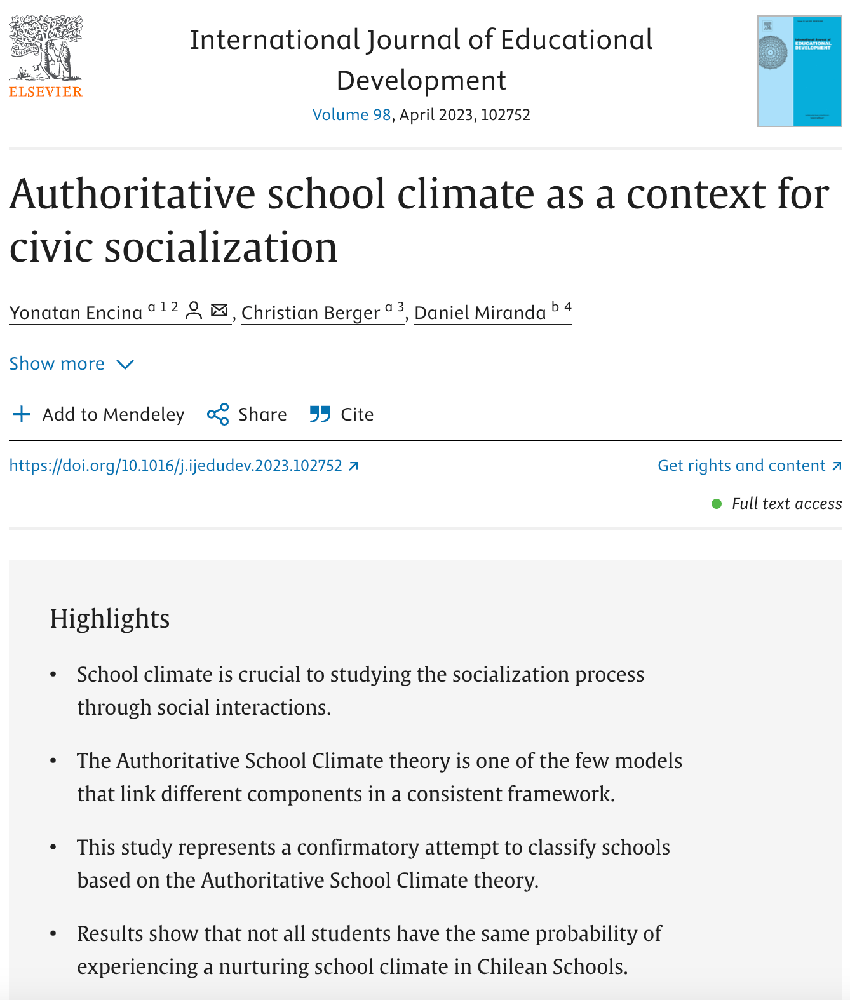{fig-align="center"}

## Un estudio en desarrollo

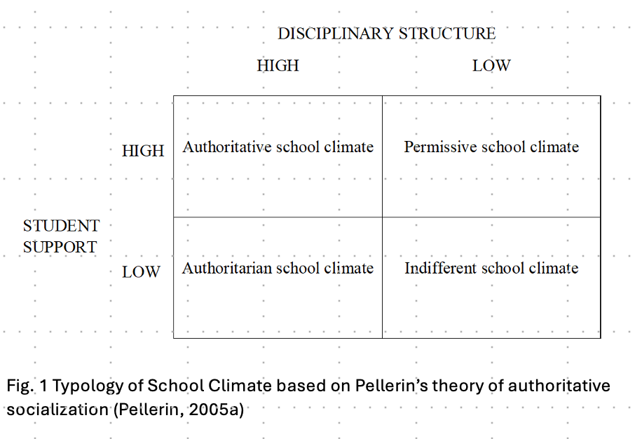{fig-align="center"}

## Un estudio en desarrollo

-   Comprender los procesos de influencia de la familia y la escuela sobre el compromiso cívico de los estudiantes, independientes y combinados.

-   Evaluar en qué medida los efectos familiares (medidos a través de la participación de los padres en la escuela, los antecedentes socioeconómicos y socioculturales) y los estilos de clima escolar (democrático, permisivo, autoritario e indiferente) promueven el compromiso cívico de los estudiantes.

-   Evaluar en qué medida los efectos familiares y los estilos de clima escolar interactúan para promover compromiso cívico de los estudiantes.

## Un estudio en desarrollo

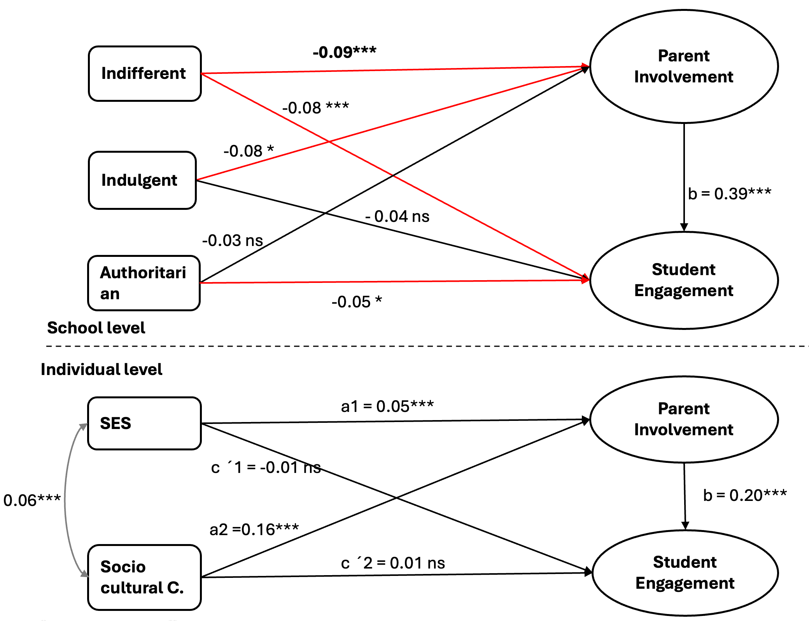{fig-align="center" width="80%"}

# Estudios nacionales e Internacionales

## Estudios Nacionales e Internacionales

-   IEA Civic Education Study, CIVED 1999. Australia, Belgium (French), Bulgaria, Canada, Chile, Colombia, Cyprus, Czech Republic, Denmark, England, Estonia, Finland, Germany, Greece, Hong Kong SAR, Hungary, Israel, Italy, Latvia, Lithuania, Netherlands, Norway, Poland, Portugal, Romania, Russian Federation, Slovak Republic, Slovenia, Sweden, Switzerland, and United States.

## Estudios Nacionales e Internacionales

-   International Civic and Citizenship Education Study, ICCS 2009

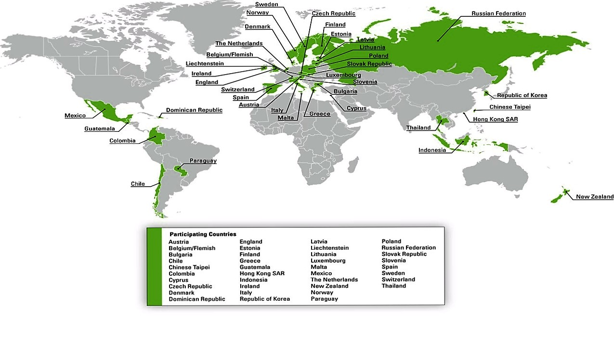

## Estudios Nacionales e Internacionales

-   International Civic and Citizenship Education Study, ICCS 2016: Belgium (Flemish), Bulgaria, Chile, Chinese Taipei, Colombia, Croatia, Denmark, Dominican Republic, Estonia, Finland, Germany (North Rhine-Westphalia), Hong Kong SAR, Italy, Korea, Latvia, Lithuania, Malta, Mexico, Netherlands, Norway, Peru, Russian Federation, Slovenia, and Sweden.

-   CELS: The Citizenship Educational Longitudinal Study - 2001-2010 [Link](https://www.nfer.ac.uk/research/projects/cels/)

## Estudios Nacionales e Internacionales

-   Estudio Panel Sueco. Desde 2009: 5000 adolescentes y adultos jóvenes entre 13-30 por un periodo de 6 años. \\url{https://www.oru.se/PSP/

-   Belgian Political Panel Survey (BPPS), 2006-2011. 6000 adolescentes [Link](https://lirias.kuleuven.be/handle/123456789/314889)

-   Estudio de Educación Cívica 2017. Agencia de la Calidad de Educación. [Link](https://www-iea-nl.translate.goog/studies/iea/iccs/2027?_x_tr_sl=en&_x_tr_tl=es&_x_tr_hl=es&_x_tr_pto=tc)

-   Panel Chileno de Socialización Política, 2019-2021. 1500 jóvenes, familias y profesores.

## Algunos resultados


## Algunos resultados

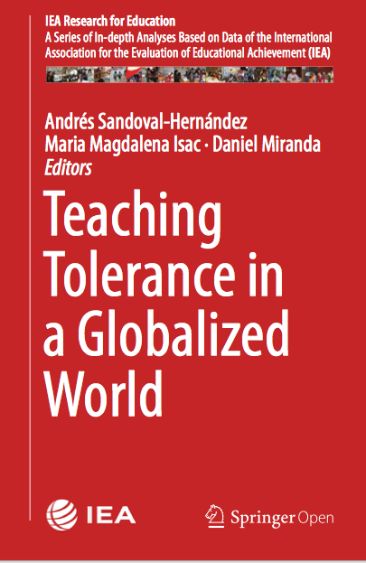

## Algunos resultados

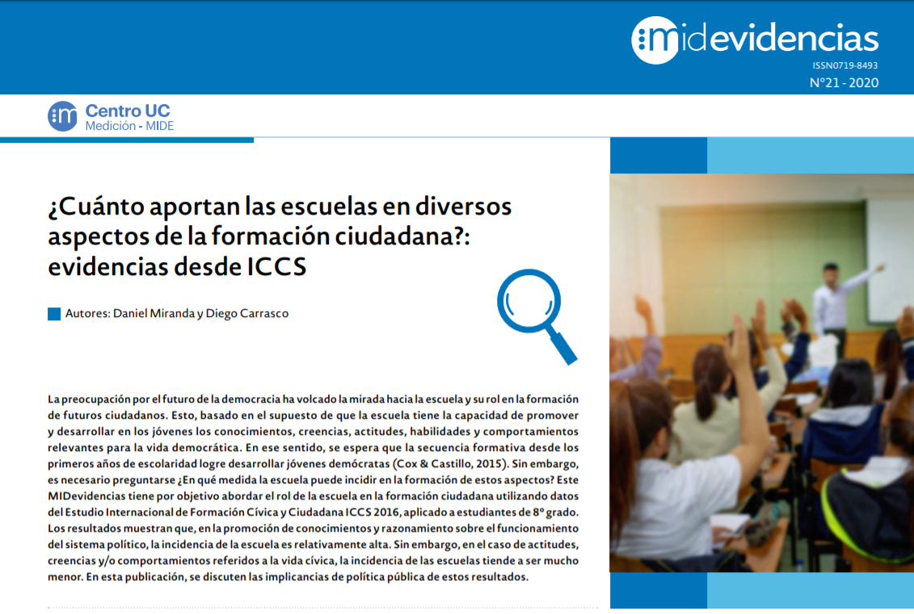

## Algunos resultados

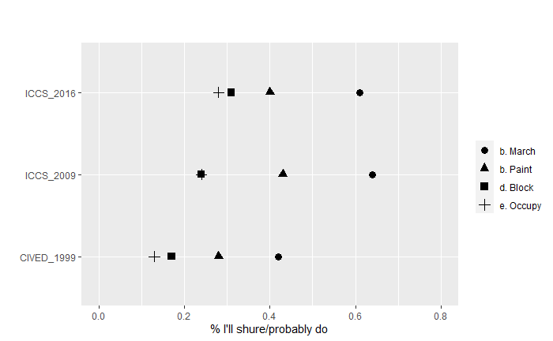

## Algunos resultados

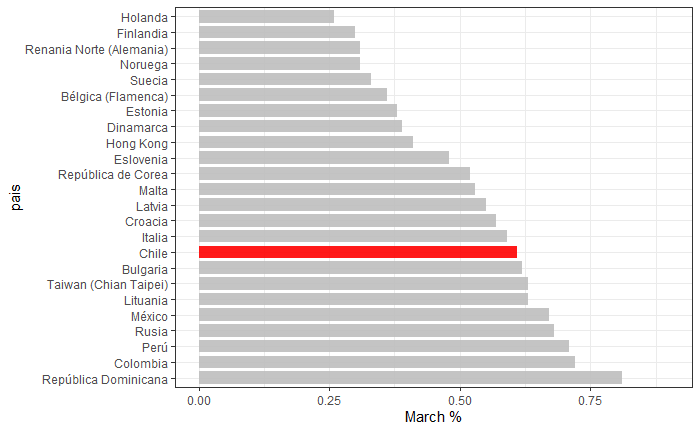

## Algunos resultados

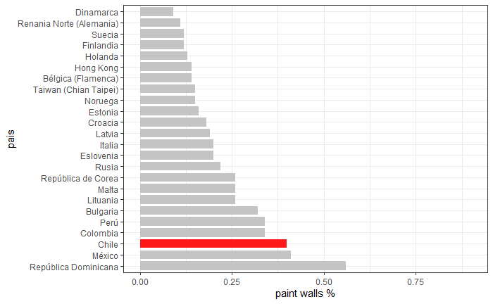

## Algunos resultados

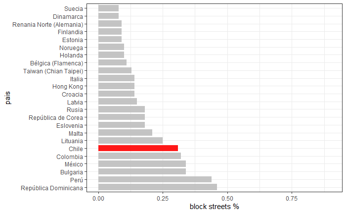

## Algunos resultados

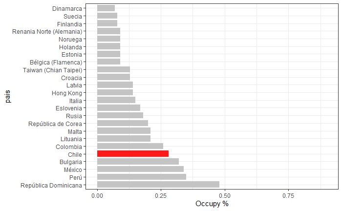

## Algunos resultados

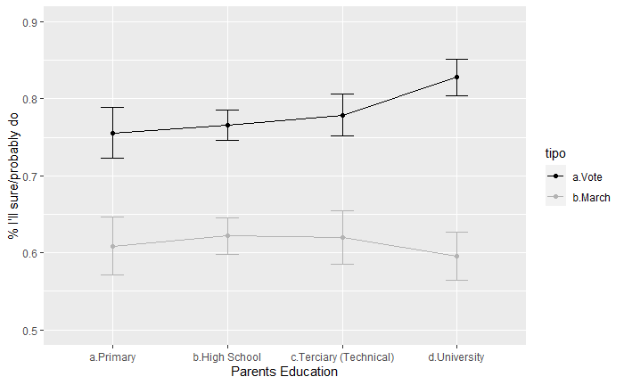

## Algunos resultados

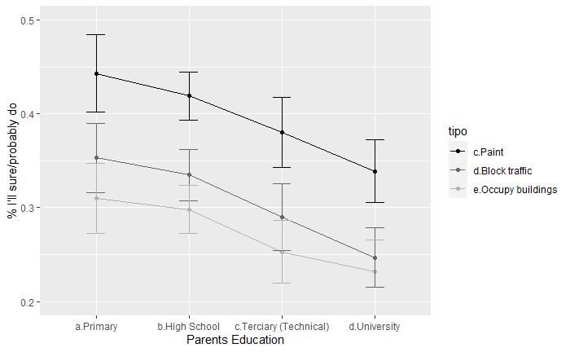

## Algunos resultados

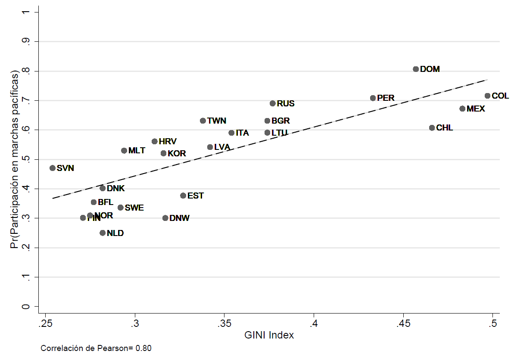

## Algunos resultados

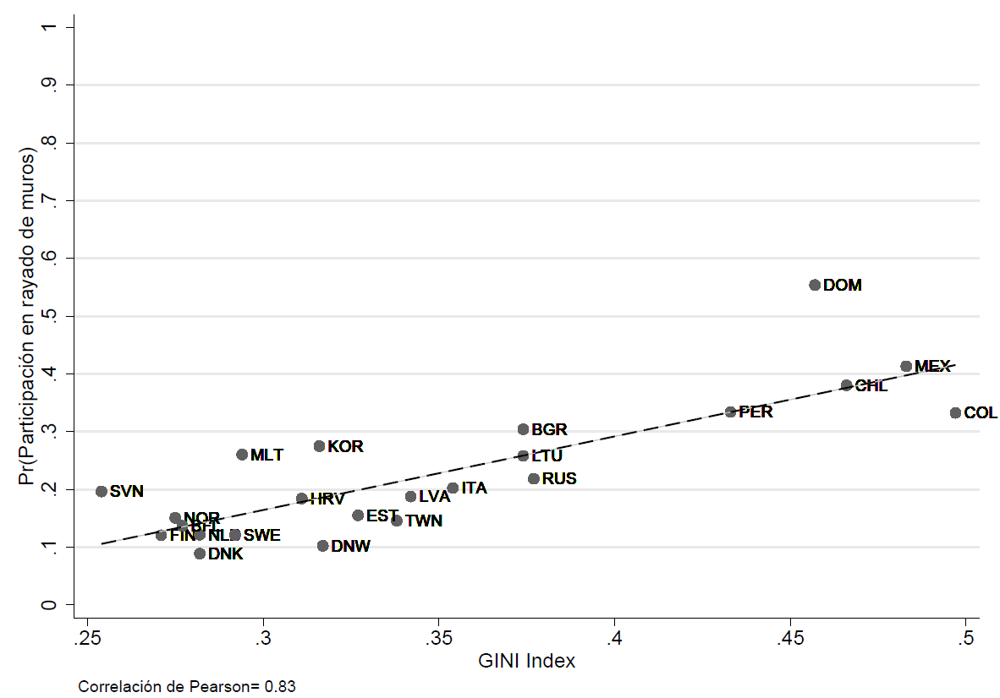

## Algunos resultados

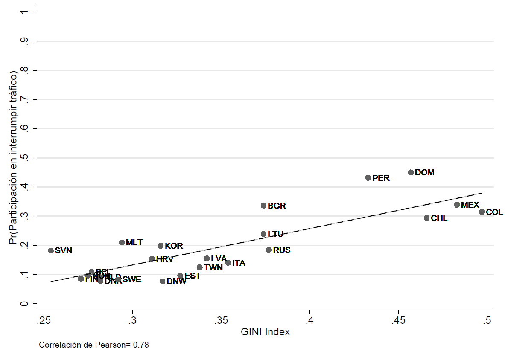

## Algunos resultados

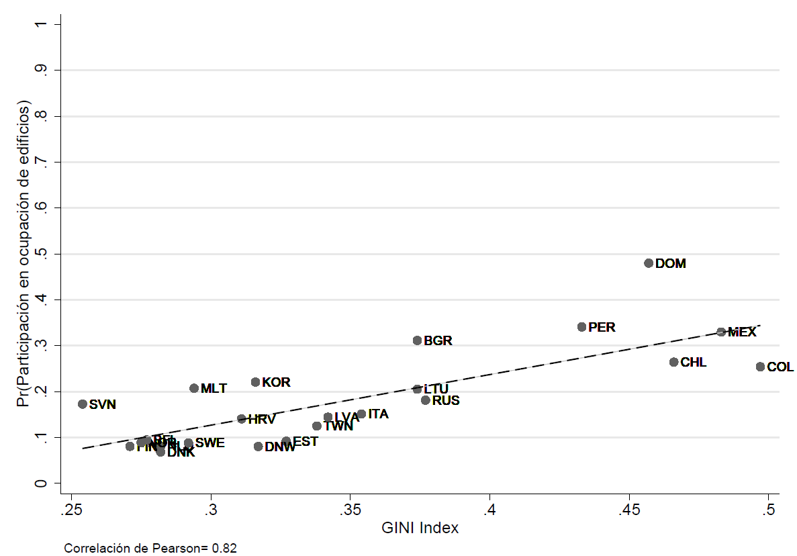

## 

::: columns
::: {.column width="15%"}


FOND


:::

::: {.column .column-right width="85%"}
<br>

## **Socialización política juvenil: participación, creencias, actitudes y conocimiento**

------------------------------------------------------------------------

Daniel Miranda

::: {.blue .medium}
Contacto: danmiranda\@uchile.cl
:::

2025
:::
:::
