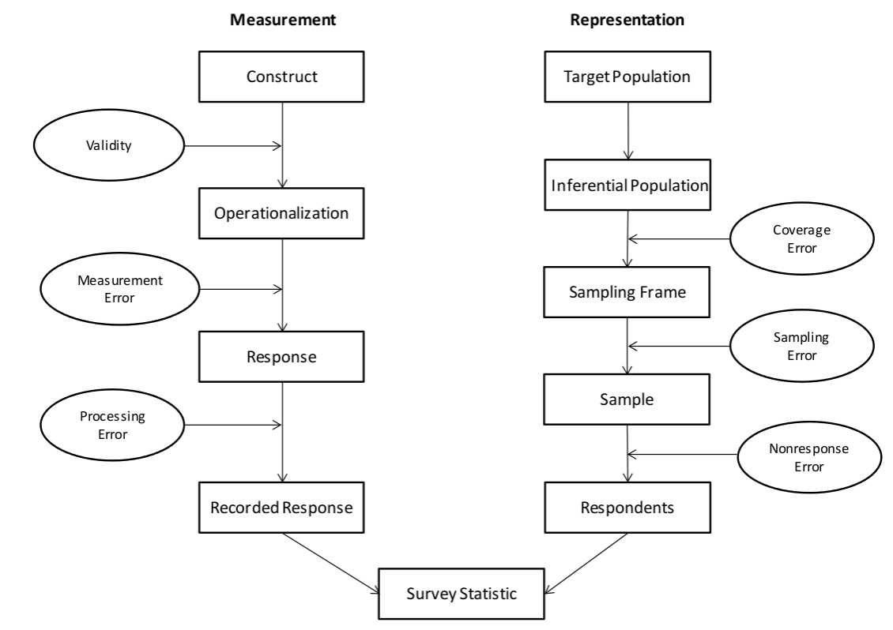
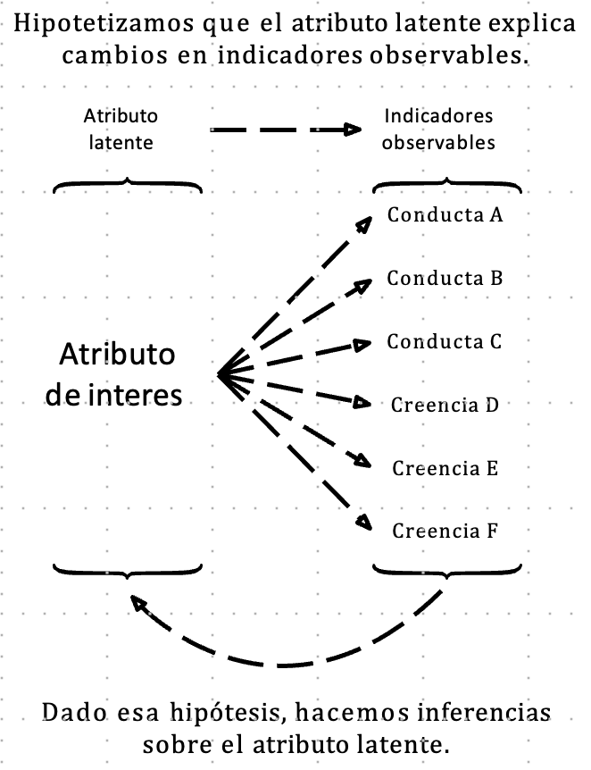
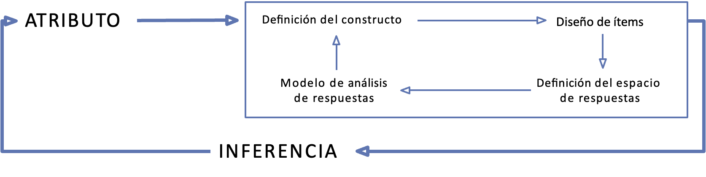

## Contenidos

-   Marco de la Investigación
-   Muestreo
-   Diseño de la encuesta

# Marco de la Investigación

## Proyecto

Título: Actitudes y comportamiento político juvenil: desigualdad, estilos de socialización escolar e influencias intergeneracionales

FONDECYT regular 1240922

Periodo: 2024-2028

Equipo: Paula Luengo-Kanacri (UC), Felipe Sanchez-Barría (UC), Nicolás Angelcos (UChile), Yonatan Encina (UTalca), Daniel Miranda (UChile).

## Objetivos

Objetivo general:

Describir y examinar distintos procesos de socialización política a nivel familiar-escolar y cómo estos influyen en el desarrollo de las actitudes y comportamiento político.

Objetivos específicos:

• Describir la estabilidad o cambios de la influencia de procesos de socialización política familiar sobre distintos tipos de comportamiento y actitudes políticas de los jóvenes a lo largo de la enseñanza media.

## Objetivos

Objetivos específicos:

• Describir y examinar la influencia de características sociopolíticas de los jóvenes sobre el comportamiento y actitudes políticas de sus padres/madres/cuidadores-as.

• Describir los estilos de socialización política a nivel familiar y escolar examinando su influencia sobre distintos tipos de comportamientos políticos de los jóvenes.

• Describir y examinar las diferencias en los procesos de socialización política familiar y escolar, según distintas condiciones socioeconómicas.

## Modelo general

# Muestreo

## Problemas y deciciones sobre la muestra

Aproximadamente 2100 estudiantes, sus cuidadores y profesores, provenientes de 70 escuelas.

{width="70%"}

# Diseño de la encuesta: Conceptos

## Conceptos posibles

-   "participation in civil society, community and/or political life, characterized by mutual respect and non-violence and in accordance with human rights and democracy" (2006¸ pp. 4).

## Modelo(s) de ciudadanía

{width="80%"}

## Modelo(s) de ciudadanía

## Modelo(s) de ciudadanía

## Modelo(s) de ciudadanía

## Estudios Nacionales e Internacionales

-   IEA Civic Education Study, CIVED 1999. Australia, Belgium (French), Bulgaria, Canada, \\textbf{Chile, Colombia, Cyprus, Czech Republic, Denmark, England, Estonia, Finland, Germany, Greece, Hong Kong SAR, Hungary, Israel, Italy, Latvia, Lithuania, Netherlands, Norway, Poland, Portugal, Romania, Russian Federation, Slovak Republic, Slovenia, Sweden, Switzerland, and United States.

## Estudios Nacionales e Internacionales

-   International Civic and Citizenship Education Study, ICCS 2009

## Estudios Nacionales e Internacionales

-   International Civic and Citizenship Education Study, ICCS 2016: Belgium (Flemish), Bulgaria,\\textbf{Chile, Chinese Taipei, Colombia, Croatia, Denmark, Dominican Republic, Estonia, Finland, Germany (North Rhine-Westphalia), Hong Kong SAR, Italy, Korea, Latvia, Lithuania, Malta, Mexico, Netherlands, Norway, Peru, Russian Federation, Slovenia, and Sweden.

-   CELS: The Citizenship Educational Longitudinal Study - 2001-2010 \\url{https://www.nfer.ac.uk/research/projects/cels/

## Estudios Nacionales e Internacionales

-   Estudio Panel Sueco. Desde 2009: 5000 adolescentes y adultos jóvenes entre 13-30 por un periodo de 6 años. \\url{https://www.oru.se/PSP/

-   Belgian Political Panel Survey (BPPS), 2006-2011. 6000 adolescentes ( \\url{https://lirias.kuleuven.be/handle/123456789/314889)

-   Estudio de Educación Cívica 2017. Agencia de la Calidad de Educación.

-   Panel Chileno de Socialización Política, 2019-2021. 1500 jóvenes, familias y profesores.

# Diseño de la encuesta: Medición

## Medición en Ciencias Sociales

-   Depende de qué se está entendiendo por "medir": teorías de medición

-   Depende de lo que pretendo medir: conceptos

-   Depende de lo que pretendo hacer con los resultados de la medición: usos

-   Depende de la calidad del instrumento de medición que se usó para medir el atributo: estandares de medición

## Medición: operacionalización de los conceptos

{fig-align="center" width="90%"}

## Medición: operacionalización de los conceptos

## Algo sobre estandares.

{width="80%"}
