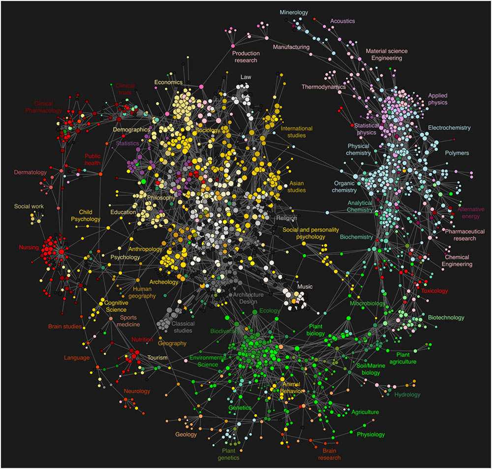
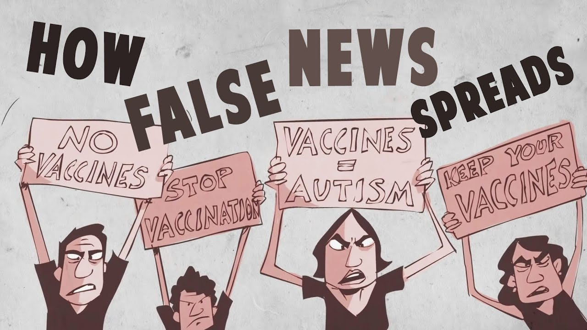
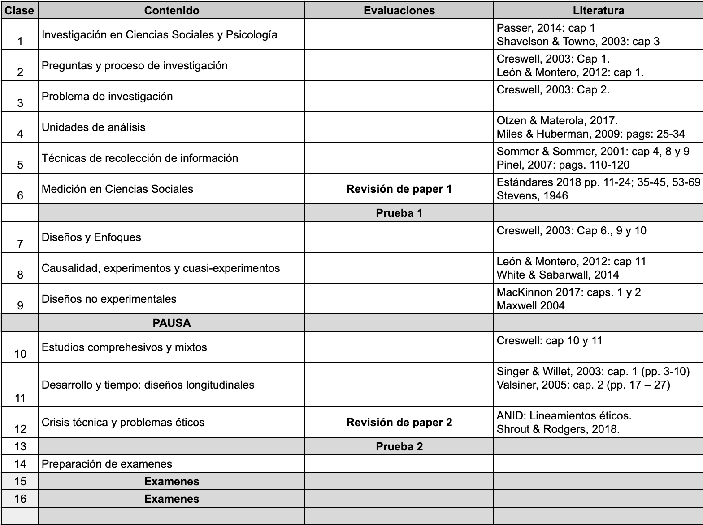
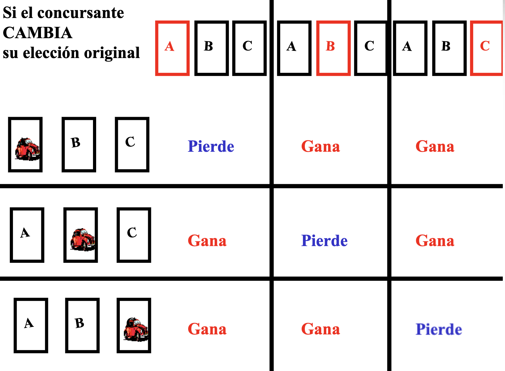
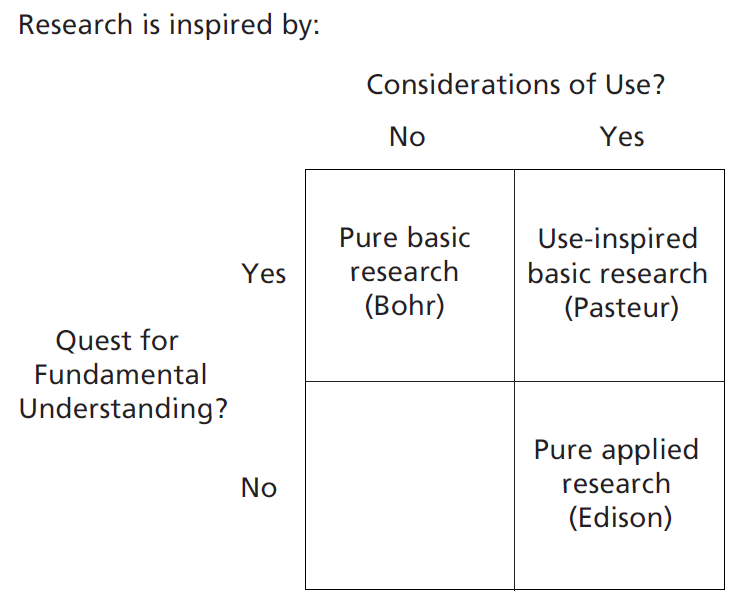
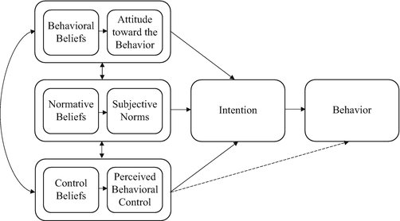

```{r setup_theme, include = FALSE}
light_color <- 'white'
text_color <- '#000FFF'
gray <- "#333333"
blue <- "#4466B0"

library(xaringanthemer)
style_duo(
  # colors
  primary_color = light_color,
  secondary_color = text_color,
  header_color = text_color,
  text_color = text_color,
  code_inline_color = colorspace::lighten(text_color),
  text_bold_color = colorspace::lighten(text_color),
  link_color = text_color,
  title_slide_text_color = text_color,
  background_position = 'center',
  header_font_google = google_font("Lato"),
  text_font_google   = google_font("Lato", "300", "300i"),
  code_font_google   = google_font("Droid Mono"),
  code_font_size = '50%',
  padding = "0.4em 2.4em 0.4em 2.4em",
  extra_fonts = list(google_font("Lato")),
  extra_css = 
  list(
  ".red"   = list(color = "red"),
  ".small" = list("font-size" = "90%"),
  ".pull_l_70" = list("float" = "left","width" = "72%", "font-size" = "90%"),
  ".pull_r_30" = list("float" = "right","width" = "23%"),
  ".pull_left"  = list("float" = "left","width" = "47%", "height" = "100%", "padding-right" = "2%"),
  ".pull_right" = list("float" = "right","width" = "47%", "height" = "100%", "padding-left" = "2%"),
  ".small_left"  = list("float" = "left", "width" = "47%", "height" = "50%", "padding-right" = "2%"),
  ".small_right" = list("float" = "right","width" = "47%", "height" = "50%", "padding-left"  = "2%"),
  ".left_code" = list("float" = "left",  "width" = "47%", "height" = "100%", "padding-right" = "2%",
    "font" = "Hack"),
  ".code_out"  = list("float" = "right", "width" = "47%", "height" = "100%", "padding-left"  = "2%",
    "font" = "Hack"),
  ".text_180" = list("font-size" = "180%"),
  ".text_170" = list("font-size" = "170%"),
  ".text_160" = list("font-size" = "160%"),    
  ".text_150" = list("font-size" = "150%"),
  ".text_140" = list("font-size" = "140%"),  
  ".text_130" = list("font-size" = "130%"),
  ".text_120" = list("font-size" = "120%"),
  ".text_110" = list("font-size" = "110%"),
  ".text_110" = list("font-size" = "110%"),
  ".text_100" = list("font-size" = "100%"),
  ".text_90" = list("font-size" = "90%"),
  ".text_80" = list("font-size" = "80%"),
  ".text_70" = list("font-size" = "70%"),
  ".text_60" = list("font-size" = "60%"),
  ".text_50" = list("font-size" = "50%"),
  ".text_40" = list("font-size" = "40%"),
  ".text_30" = list("font-size" = "30%"),
  ".text_20" = list("font-size" = "20%"),
  ".line_space_11" = list("line-height" = "1.1em;"),
  ".line_space_09" = list("line-height" = "0.9em;"),
  ".line_space_07" = list("line-height" = "0.7em;"),
  ".line_space_05" = list("line-height" = "0.5em;"),
    ".tiny_text" = list(
      "font-family" = "Lato", 
      "font-size"= "70%"
      ),
    ".large_text" = list(
      "font-family" = "Lato", 
      "font-size"= "150%"
      ),
    ".slide_blue" = list(
      "background-color" = "#1068E9",
      "color" = "white"
      ),
  ".center_image" = list(
    margin  = "0",
    position = "absolute",
    top      = "50%",
    left     = "50%",
    '-ms-transform' = "translate(-50%, -50%)",
    transform = "translate(-50%, -50%)"
    )
  )
)


knitr::opts_chunk$set(comment = NA)
knitr::opts_chunk$set(dpi=1500)
# xaringanthemer::mono_light(background_position = 'center')

# preview slides
# xaringan::inf_mr('invalsi_workshop_template.rmd')


# padding-top: 0.4em;
# padding-right: 2.4em;
# padding-bottom: 0.4em;
# padding-left: 2.4em;

```

class: center, middle

# Metodología de la Investigación Social


Clase 1

##### Daniel Miranda

<br>

```{r echo=FALSE, out.width = '10%', eval=FALSE}


```

2025

---
class: center, middle, inverse

## Presentación general

---
## Descripción

Al finalizar el curso el/la estudiante:  

-	Comprende los fundamentos, potencialidades y limitaciones de la investigación científica en ciencias sociales en general y en psicología en particular.  

-	Identifica y plantea preguntas de investigación, define objetivos, formula hipótesis y construye un punto de vista teórico para el abordaje de dichas preguntas. 

-	Identifica diseños de investigación, técnicas de selección de participantes y técnicas de producción de información, adecuados para abordar una pregunta de investigación concreta.

-	Comprende los aspectos éticos inherentes a la investigación social con y sobre seres humanos. 

---
class: center, middle, inverse

## ¿En qué es única la investigación en ciencias sociales - psicología?


---

```{r echo=FALSE, out.width= '65%', fig.align='center'}

```


---

```{r echo=FALSE, out.width= '90%', fig.align='center'}

```


---
## Propósito

Curso teórico-práctico del ciclo básico que tiene como propósito que los estudiantes conozcan los fundamentos de la metodología de la investigación científica en ciencias sociales y distingan los principales diseños utilizados.


---
## Contenidos

Unidad 1: Fundamentos de la Investigación Científica en Ciencias Sociales  

-	La ciencia y el método científico.  

-	La investigación científica en Ciencias Sociales y en Psicología. 

-	El proceso de investigación en Ciencias Sociales


---
## Contenidos

Unidad 2: Problemas de investigación y su abordaje

-	Problemas de Investigación: Ideas, preguntas y objetivos de investigación. 

-	Justificación de una investigación: revisión bibliográfica, construcción del marco teórico y formulación de hipótesis. 

-	Diferencias al interior de la investigación social: enfoques cuantitativo, cualitativo y mixto. 

-	Unidades de análisis y procedimientos de muestreo.

-	Técnicas de recolección de información.


---
# Contenidos

Unidad 3: Diseños de investigación 

-	Preguntas y tipos de diseños de investigación

-	Diseños experimentales y no-experimentales

-	Diseños cualitativos

-	Diseños que abordan el tiempo


Unidad 4: Crisis técnica y ética de la investigación

-	Crisis de replicación en Psicología

-	Ética aplicada a la investigación científica en Psicología


---
## Metodología

-	Sesiones de clases lectivas presenciales semanales, donde se presentarán los aspectos centrales de los contenidos correspondientes a la semana.

    + Las clases lectivas en general se acompañan de documentos de presentación, que estarán disponibles antes de la sesión en la página del curso.

    + Excepcionalmente podrá definirse algunas clases formato remoto o asincrónico.
    
-	Lectura de bibliografía por parte de los estudiantes. Los textos que abordan los contenidos del curso estarán disponibles antes de las sesiones correspondientes para ser leídos por parte de los estudiantes antes de cada sesión. 

-	Trabajo en plataforma virtual: los temas del curso se acompañan de actividades prácticas de aplicación de contenidos. Estas actividades están diseñadas para ser desarrolladas de manera autónoma, y también habrá espacio de revisión y consultas en el espacio de clases.

-	Análisis crítico de artículos científicos: se desarrollarán un análisis crítico de un artículo científico que permitirán a l_s participantes aplicar contenidos. Los trabajos serán asesorados por ayudantes que se asignarán a cada grupo.


---
## Evaluaciones
El curso se evaluará por medio de las siguientes actividades: 

-	Trabajo en plataforma virtual: Se realizarán breves guías de los contenidos revisados. Al finalizar el semestre, cada estudiante podrá eliminar 2 de estas notas. El promedio de las guías tiene una ponderación de 15% en la nota de presentación a examen.

-	Pruebas escritas: Se realizarán dos pruebas individuales de aplicación de los contenidos de las unidades del curso. Estas evaluaciones tienen una ponderación de 25% cada una en la nota de presentación a examen. 

-	Análisis crítico de un artículo científico: Durante la asignatura los/as estudiantes deberán desarrollar un análisis crítico de un artículo científico. Este será realizado en pares de estudiantes. Se realizarán dos entregas en formato de este análisis. La primera entrega tiene una ponderación de 15% en la nota de presentación a examen y la segunda un 20%. 

-	Examen: Quienes tengan una nota inferior a 4,0 en el promedio de las pruebas o una nota de presentación a examen inferior a 5,5 deberán rendir un examen escrito individual de aplicación de todos los contenidos del curso. Esta evaluación tiene una ponderación de 40% en el promedio final de la asignatura.

- Examen de recuperación: Quienes al final del semestre no alcancen la nota mínima de 4,0 tienen derecho a presentarse a examen de segunda oportunidad, cuya ponderación en el promedio final es un 40%. 


---
## Fechas
|Fecha	|Tipo de evaluación |
|:------|:------------------|
|17.04	|Entrega 1 – Análisis de Artículo (15%) |
|24.04	|Prueba 1 (25%)|
|12.06	|Entrega 2 – Análisis de Artículo (20%) |
|19.06	|Prueba 2 (25%)|
|Semanal|Actividades en línea (15%) |
|       |                           |
|03.07	|Examen (40%) |
|10.07	|Examen 2° instancia|


---

## Calendario

```{r echo=FALSE, out.width = '60%', fig.align='center'}

```

---
class: center, middle, inverse

## Algunas reglas generales


---
## Funcionamiento en contexto de clases

+ La inasistencia a clases obligatorias y/o evaluaciones deben ser justificadas en un plazo de 5 días hábiles en Secretaría de Estudios al correo, adjuntando los antecedentes. Esto se realiza vía plataforma U-Campus o por correo a secest.psicologia@uchile.cl 

+ Lectura anticipada

---
class: center middle, inverse

# ¿Qué es la Ciencia?

---
# El problema del presentador (Monty Hall)

```{r echo=FALSE,  out.width= '70%', fig.align='center'}
knitr::include_graphics('./files/puerta.png')
```

---
# Métodos de adquisión de conocimiento

- Tenacidad: sabiendo por la fuerza del hábito

- Autoridad: sabiendo gracias a otros

- Razón: sabiendo gracias a la lógica y la racionalidad

- Empirismo: sabiendo a través de la experiencia

  + **Ciencia: confiar en el empirismo sistematico**


---
class: center middle, inverse
# Tenacidad 
---
# El lado b de la tenacidad 
-	Implica creer en algo simplemente porque es lo que hemos creído durante mucho tiempo. No hay exploración de las creencias de uno, ni contemplación racional de puntos de vista opuestos. 

-	Peirce (1877) sostuvo que la tenacidad implica el cierre de uno mismo a la información que es incoherente, o que amenaza una creencia firmemente sostenida.

-	Negarse a considerar la evidencia contraria reduce la probabilidad de formar creencias exactas las creencias tenazmente sostenidas pueden ser correctas. Podemos distinguir entre el método sobre el cual se basa el conocimiento y la precisión de ese conocimiento

---
class: center middle, inverse
# Autoridad 
---
# Implica depender de otras personas como nuestra fuente de conocimiento y creencias
- Creemos que la persona tiene experiencia en el tema.

- Percibimos a la persona como digna de confianza.

- Depender de la autoridad puede ser muy eficiente.

- Sin embargo, la autoridad también tiene limitaciones y escollos:
    + Los/as expertos pueden mostrar opiniones diferentes
    + Atribuimos experiencia a fuentes que no la tienen o descartamos fuentes expertas
    
---
class: center middle, inverse

# Razón 

---
# Lógica y racionalidad 
- El uso de la lógica y el argumento racional son parte integral de la ciencia, en forma de razonamiento

- Los científicos usan el razonamiento cuando construyen teorías para dar cuenta de hechos conocidos y cuando derivan hipótesis de teorías para probar esas teorías. 

- Pero el conocimiento científico no se basa en el método de la razón. La limitación primaria del método de la razón es que diversas conclusiones lógicas emergen dependiendo de las premisas con las que uno comienza.

```{r echo=FALSE,  out.width= '50%', fig.align='center'}
knitr::include_graphics('./files/supuesto.png')
```

---
# Solución lógica

```{r echo=FALSE,  out.width= '50%', fig.align='center'}

```

---
class: center middle, inverse
# Empirismo

---
# Empirismo: conocimiento basado en la experiencia

- Conocimiento empírico 

- **Una gran parte de lo que sabemos viene directamente de nuestros sentidos: por lo que vemos, oímos, tocamos, etc**.

---
# Empirismo: proceso de adquirir conocimiento directamente a través de la observación y la experiencia.

*[filosóficamente: todo conocimiento se deriva de la experiencia]*.

- ¿pero es todo adquirible a través de la experiencia y la observación? 

--

- ¿puedo conocer empíricamente la sensación térmica de -50°c?

---
# Empirísmo

- Las fronteras del conocimiento empírico 

- Conocimiento empírico “vicario” (comunidad científica)

- Reconocimiento de la “subjetividad” en las propias experiencias y experiencias sensoriales

- El recuerdo e interpretación de la propia experiencia puede estar sesgado (ej. Sesgo de simpatía) 

---
class: center middle, inverse 

# ¿cómo se podría aplicar el enfoque empírico para resolver el dilema de las tres puertas?

---
class: center 
```{r echo=FALSE, message=FALSE, error=FALSE, warning=FALSE, out.width= '50%'}
# Won the game or not
sim.won <- function(prize.door, first.door, switching){
  as.numeric(ifelse(first.door == prize.door, !switching, switching))
}

# Simulates randomly n door choices (1/3 probability for each door initially)
sim.choose.door <- function(n){
  door.prob <- runif(n)
  ifelse(door.prob <= 1/3, 1, ifelse(door.prob <= 2/3, 2, 3))
}

# Simulates randomly n choices of switching (TRUE) or not (FALSE)
sim.choose.switching <- function(n){
  switching.prob <- runif(n)
  ifelse(switching.prob <= 1/2, TRUE, FALSE)
  
}

# Simulates n games and calculates the probability of winning by switching or not switching
sim.game <- function(n=1000){
  prize.door <- sim.choose.door(n) # Define prize door (n times)
  first.door <- sim.choose.door(n) # Chose first door (n times)
  switching <- sim.choose.switching(n) # Define if will switch first door (n times)
  won <- sim.won(prize.door, first.door, switching) # Calculates the outcome of each run
  
  df <- data.frame(won = won, switching = switching) # Put runs in data frame
  
  # Calculate probabilities from the outcomes
  prob.win.switching <- table(df$won, df$switching)[2,2]/sum(table(df$won, df$switching)[,2])
  prob.win.not.switching <- table(df$won, df$switching)[1,2]/sum(table(df$won, df$switching)[,1])
  
  return(c(prob.win.switching, prob.win.not.switching))
}

# Plots distributions of probabilities using data frame with columns prob.win.switching and prob.win.not.switching
plot.probs <- function(df, bins = 50){
  require(ggplot2)
  require(gridExtra)
  
  # Plot for Switching
  bw <- (max(df$prob.win.switching) - min(df$prob.win.switching))/(bins - 1)
  h1 <- ggplot(df, aes(prob.win.switching)) + geom_histogram(binwidth = bw) + 
    ggtitle('Switching') + xlab('Probability of Winning') + ylab('Frequency') + 
    geom_vline(xintercept = mean(df$prob.win.switching), colour='red') + 
    scale_x_continuous(breaks = c(0.20,0.30,0.40,0.50,0.60,0.80, round(mean(df$prob.win.switching),3)), limits=c(0.20, 0.80))
  
  # Plot for NOT Switching
  bw <- (max(df$prob.win.not.switching) - min(df$prob.win.not.switching))/(bins - 1)
  h2 <- ggplot(df, aes(prob.win.not.switching)) + geom_histogram(binwidth = bw) + 
    ggtitle('NOT Switching') + xlab('Probability of Winning') + ylab('Frequency') + 
    geom_vline(xintercept = mean(df$prob.win.not.switching), colour='red') +
    scale_x_continuous(breaks = c(0.20,0.40,0.50,0.60,0.70,0.80, round(mean(df$prob.win.not.switching),3)), limits=c(0.20, 0.80))
  
  grid.arrange(h1, h2, nrow = 2, top="Distributions of Probability of Winning")
}

# Executes, repeated times, n runs of Monty Hall problem, also showing plot and descriptive results
dist.game <- function(reps=300, n=100){
  # Minimum n is 100
  if(n < 100){
    n <- 100
  }
  # Minimum reps is 300
  if(reps < 300){
    reps <- 300
  }
  
  dist <- data.frame(prob.win.switching = rep(0, times = reps),
                     prob.win.not.switching = rep(0, times = reps))
  
  # Repeating, "reps" times, "n" runs of Monty Hall problem 
  for(i in 1:reps){
    dist[i, ] <- sim.game(n)
  }
  
  # Plots distributions
  plot.probs(dist)
  
  # Returns descriptive results
}

dist.game(1000, 1000)

```

---
class: center, middle, inverse
# ¿Qué es esa cosa llamada ciencia?

## La ciencia es un proceso de recolección y evaluación sistemática de evidencia empírica para responder preguntas y testear ideas.

---
# Empirismo sistemático 

1.	La ciencia se basa en la evidencia empírica

2.	La evidencia empírica no se recoge ni se interpreta al azar (hay un “plan”)

3.	Es necesario el razonamiento para interpretar las evidencias

*razonamiento sirve para evaluar las evidencias y formular buenas preguntas*


---
class: inverse, middle, center
# Objetivos de la ciencia

## Describir 
## Explicar
## Predecir
## Controlar  

---
# Describir 

- "describir o descubrir las leyes de la naturaleza"


---
# Describir

- Implica identificar las características de un fenómeno o una variable 

- Implica desarrollar sistemas de codificación

- En psicología: implica identificar cómo la gente se comporta, siente y piensa en varios escenarios.


---
# Explicar 

- ¿por qué ocurre lo que ocurre?

- ¿por qué en ciertas regiones de chile la tasa de violencia escolar es mayor que en otras? 

- ¿por qué  …..? 

- Explicar – conjeturar

---
# Hipótesis 

Es una proposición tentativa sobre las causas o el resultado de una variable o sobre cómo éstas están relacionadas generalmente se anclan en teorías existentes y evidencias empíricas anteriores

- También emergen de: Corazonada + razonamiento 

- Mucha evidencia empírica acumulada 

---
# Teoría 

Es un conjunto de instrucciones formales que especifica cómo y por qué se relacionan las variables o los eventos. Las teorías son más amplias que las hipótesis. 

- Distinto alcance 

- Ejemplos de teorías en psicología (…) 

    - ¿Por qué existe la violencia escolar? 

---
# ¿Explicación fácil?

- Explicaciones biogenéticas

- Explicaciones de personalidad 

- Explicaciones ambientales y de socialización 

- Explicaciones (…)

---
# Explicar 

- causas distales y próximales


---
# Predecir 

- ¿es posible anticipar lo que ocurrirá si ….? 

- ¿vaticinar el futuro?

- En primer lugar, la predicción es el medio más fuerte por el cual los científicos determinan si sus explicaciones para los acontecimientos son correctas. Si realmente entendemos por qué se produce un evento, qué lo causa, entonces deberíamos ser capaces de predecir las circunstancias en las que ocurrirá ese evento.


---
# Predecir  

Si … entonces …. Hagan proposiciones predictivas (desde la psicología) para los siguientes fenómenos: 
 
- Bienestar en la adultez mayor 
- Prejuicios hacia inmigrantes
- Diferencias salariales de género 
- Conductas a favor del medio ambiente 
- Participación política 

---
# Predecir 

¿Para qué predecir? 

- Para construir y validar teorías científicas

- Para mejorar, prevenir, promover, ciencia aplicada 

---
# Predecir  

- Pero !!!

- Las hipótesis no necesariamente se basan en la teoría: especialmente en las primeras etapas de la investigación sobre un tema 

- Predecir no implica necesariamente una relación causal (ej., generalmente el trueno sigue al relámpago, pero no lo “causa”) 


---
# Controlar   

Ejercer influencia 

-	Seleccionar objeto de estudio y variables + cómo medirlas; a quienes involucra, etc.

-	Para mejorar la calidad de vida de las personas: programas de intervención, tratamientos, etc. 

- Entonces …

---
# ¿Qué es esa cosa llamada ciencia?: La pregunta del millón 


---
class: center, middle, inverse

## Principios que guían el quehacer científico

---

## Shavelson & Towne (2003): 6 principios guías

+ Plantear preguntas importantes que puedan ser investigadas empíricamente.

+ Vincular la investigación con la teoría relevante.

+ Usar métodos que permitan la investigación directa de la pregunta.

+ Proporcionar una cadena de razonamiento coherente y explícita.

+ Replicar y generalizar todos los estudios.

+ Desarrollar investigaciones para alentar la reflexión y la crítica profesional.

---

## Principio 1: Plantear preguntas importantes que puedan ser investigadas empíricamente.

+ Importancia de las preguntas

```{r echo=FALSE, out.width= '40%', fig.align='center'}

```

---
## Robert Putnam
.pull_left[
.text_80[
“Las áreas con mayor participación cívica de Italia son precisamente las aldeas tradicionales del sur. El espíritu cívico de las comunidades tradicionales no debe ser idealizado. La vida en gran parte de la Italia tradicional de hoy está marcada por jerarquías y explotación, con fuertes inequidades (…).  Por el contrario, las regiones “más cívicas” de Italia, aquellas en donde los ciudadanos se sienten con poder para participar en movimientos sociales y deliberaciones colectivas y dónde éstas  manifestaciones se han traducido de manera más completa en políticas públicas efectivas, son el algunas de las ciudades más modernas de la península. La modernización no señala la desaparición de la comunidad cívica” (p. 115).
]
]

.pull_right[
```{r echo=FALSE,  out.width= '70%', fig.align='center'}
knitr::include_graphics('./files/bowling.jpg')
```
]

---
## Otros ejemplos

```{r echo=FALSE,  out.width= '50%', fig.align='center'}
knitr::include_graphics('./files/libro.jpg')
```

---
## Otros ejemplos

```{r echo=FALSE,  out.width= '30%', fig.align='center'}
knitr::include_graphics('./files/tolerance_book.png')
```


---
class: center, middle, inverse


---
## Principio 2: Vincular la investigación con la teoría relevante.

+ “Las teorías científicas son, en esencia, modelos conceptuales que explican algunos fenómenos. Son especies de redes proyectadas para atrapar lo que llamamos 'el mundo' ... Nuestro esfuerzo es esforzarnos por hacer que la malla de la red sea cada vez más fina” 
(Popper, 1959, p. 59).

+ ¿Que pasa en Psicología?¿Cúal es la relación entre teoría e investigación?

---
## Teoría

- Afecta a qué se observa

- Y a cómo se observa

- Influye en la pregunta de investigación

- En los métodos que se utilizan

- Y en la interpretación de los datos


---
## Principio 3: Usar métodos que permitan la investigación directa de la pregunta.

+ Deber ser seleccionado en función de la pregunta de investigación

+ Debe “encajar” con la pregunta de investigación

+ Se debe justificar por qué se elige dicho método

+ Hay que tener en cuenta las limitaciones

---
## Si una hipótesis es confirmada usando distintos métodos, su credibilidad aumenta.

## Comprender las habilidades para lectura

+ Cuestionarios

+ Entrevistas

+ Técnicas de Neuroimagen

---
## Principio 4: Proporcionar una cadena de razonamiento coherente y explícita.


```{r echo=FALSE, out.width= '60%'}

```
--
¿Es posible pensarlo al revés?

---
## Principio 5: Replicar y generalizar todos los estudios.

.pull_left[
+ Replicación

+ Generalización

+ Reproducibilidad 
]

.pull_right[

```{r echo=FALSE, out.width= '80%'}
knitr::include_graphics('./files/Lacour1.png')
```
]

---
```{r echo=FALSE, out.width= '70%', fig.align='center'}
knitr::include_graphics('./files/Lacour1.png')
```

---
```{r echo=FALSE, out.width= '80%', fig.align='center'}
knitr::include_graphics('./files/lacour2.png')
```

---
```{r echo=FALSE, out.width= '55%', fig.align='center'}
knitr::include_graphics('./files/lacour3.png')
```


---
## Principio 6: Desarrollar investigaciones para alentar la reflexión y la crítica profesional

+ Comunidad científica

+ Comunicación de resultados (revisión de pares)

+ Difusión amplia

---
## Siguiendo estos criterios identifiquen potenciales temas de investigación

+ Grupos aleatorios

+ Definan y discutan sobre una "buena pregunta" de investigación.

```{r echo=FALSE, out.width= '30%', fig.align='center'}

```

---

class: center, middle

### **Muchas Gracias!**


# Metodología de la Investigación Social

Clase 1

##### Daniel Miranda
##### 

<br>

2025

```{r echo=FALSE, out.width = '10%', eval=FALSE}

```