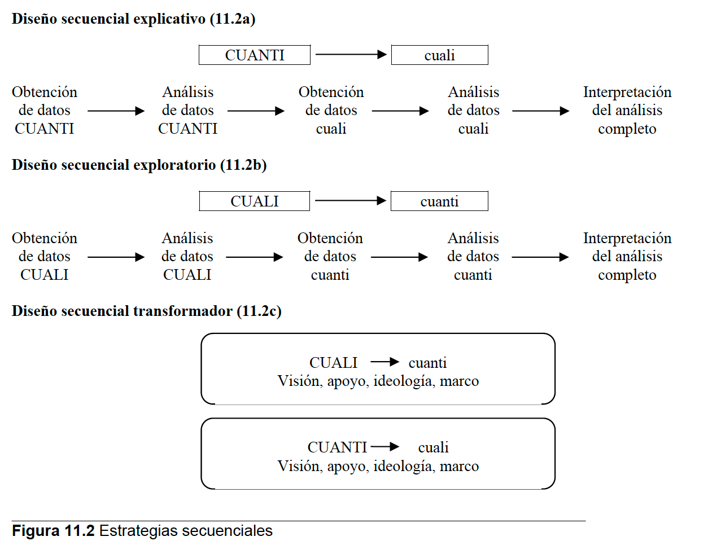
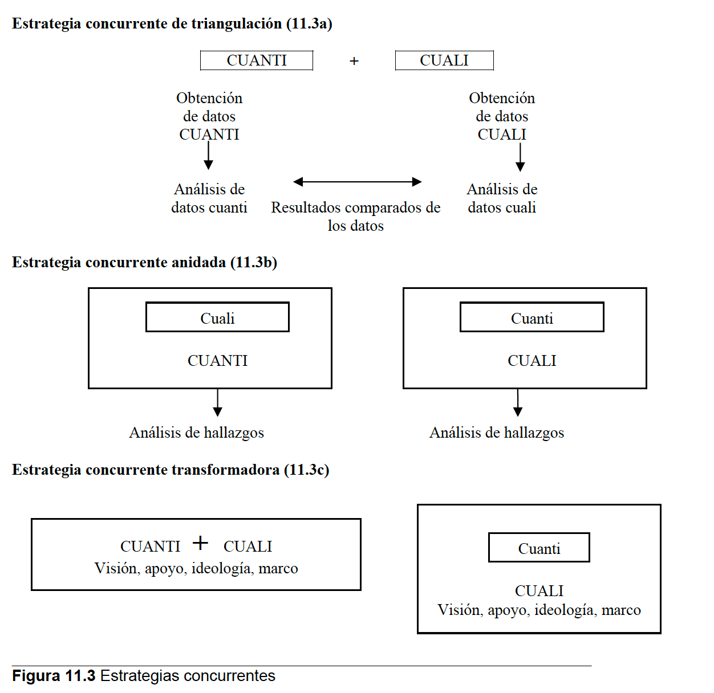
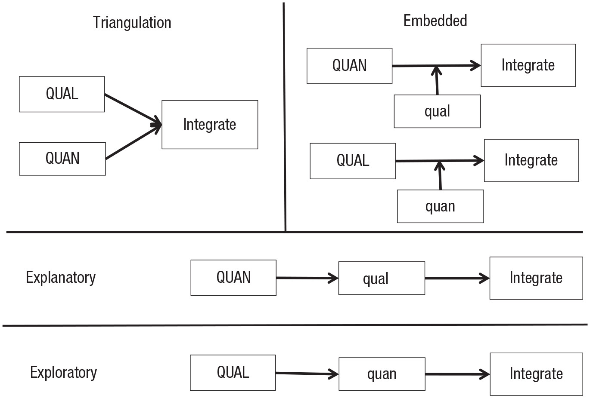

## Objetivo de la clase

Comprender las características, procedimientos y usos de la investigación cualitativa y de los métodos mixtos en las ciencias sociales y humanas.

# Investigación Cualitativa

## ¿Qué es la investigación cualitativa?

-   Indagación en escenarios naturales
-   Estudio de significados desde la perspectiva de los participantes
-   Datos no numéricos
-   Diseño flexible y emergente
-   Interpretación del investigador

## Características de la investigación cualitativa

-   Escenario natural
-   Métodos múltiples y humanísticos
-   Diseño emergente

## Características de la investigación cualitativa

-   Interpretación del investigador
-   Enfoque holístico
-   Reflexividad
-   Razonamiento inductivo-deductivo
-   Estrategias de indagación específicas

## Estrategias cualitativas

-   ¿Qué son las estrategias de indagación?
-   Relación con el tipo de problema investigado

Estrategias:

-   Narrativa
-   Fenomenología
-   Etnografía
-   Estudios de caso
-   Teoría Fundamentada

## Estrategia 1: Narrativa

-   Estudia historias de vida
-   Ejemplo: reconstrucción de eventos significativos de un sujeto

## Estrategia 2: Fenomenología

-   Explora la experiencia vivida
-   Ejemplo: cómo experimentan el duelo los estudiantes universitarios

## Estrategia 3: Etnografía

-   Estudia culturas y subculturas
-   Ejemplo: prácticas de estudiantes en comunidades de estudio

## Estrategia 4: Estudio de caso

-   Análisis profundo de un caso o contexto único
-   Ejemplo: un programa de apoyo psicológico en una universidad

## Estrategia 5: Teoría fundamentada

-   Desarrollo de teorías basadas en datos
-   Ejemplo: proceso de adaptación a la vida universitaria

## ¿Qué rol juega el investigador/a?

-   Principal instrumento de recolección
-   Participación en el campo
-   Reflexividad y subjetividad
-   Consideraciones éticas y acceso al campo

## Técnicas de recolección cualitativa

-   Observación
-   Entrevistas
-   Documentos
-   Materiales audiovisuales

## Observación cualitativa

-   Tipos: participante, no participante
-   Ventajas y desafíos

## Entrevistas cualitativas

-   Estructuradas, semi-estructuradas, abiertas
-   Registro: notas, audio, video

## Documentos y materiales visuales

-   Tipos de fuentes: públicas, privadas, imágenes
-   Uso ético y triangulación

## Análisis de datos cualitativos

-   Lectura global de datos
-   Codificación inicial

## Análisis de datos cualitativos

-   Desarrollo de temas y categorías
-   Codificación in vivo
-   Codificación abierta
-   Codificación axial
-   Codificación selectiva

## Análisis de datos cualitativos

-   Representación narrativa y visual
-   Apoyo con software cualitativo (e.g., MAXQDA, NVivo)

## Validación cualitativa

-   Triangulación de datos
-   Verificación de miembros

## Validación cualitativa

-   Clarificación de prejuicios
-   Inclusión de datos discrepantes

## Actividad breve

**Título:** Empoderamiento de Trabajadoras de Casa Particular Sindicalizadas (Del Campo & Ruiz, 2013)

::: {style="font-size: 70%;"}

Este estudio de tipo exploratorio y transversal indaga si la participación sindical de trabajadoras de casa particular ha estimulado procesos de empoderamiento individual en sus relaciones laborales. Se utilizó metodología cualitativa, recogiendo datos mediante entrevistas semi-estructuradas a las 10 socias del único sindicato del rubro existente en Santiago de Chile. Para el análisis se realizó codificación abierta, según los procedimientos de la grounded theory. Los resultados indicaron que para las socias la sindicalización contribuye al empoderamiento laboral si se conjuga con otras condiciones, principalmente, la determinación de la trabajadora a velar por sus derechos y la existencia de leyes laborales protectoras arraigadas en la sociedad.

Palabras clave: empoderamiento, trabajo doméstico, sindicato, sindicalización
:::
## Descripción de análisis y resultados

[Artículo](https://www.scielo.cl/scielo.php?script=sci_arttext&pid=S0718-22282013000100002)

# Métodos Mixtos

## ¿Qué son los métodos mixtos?

-   Combinación de enfoques cualitativos y cuantitativos
-   Responde a preguntas amplias con múltiples perspectivas

## Fundamentos filosóficos

-   Paradigma pragmático
-   Integración práctica entre datos y análisis

## Ventajas de los métodos mixtos

-   Complementariedad
-   Validación cruzada
-   Captura de la complejidad social

## Desafíos de los métodos mixtos

-   Dificultad en el diseño
-   Requiere formación amplia
-   Tensión entre paradigmas

## Diseños secuenciales

## Diseños concurrentes

## Diseños

## Muestreo y recolección

-   Muestreo cuantitativo: aleatorio
-   Muestreo cualitativo: intencional
-   Cada tipo con sus tiempos y recursos

## Integración de datos

-   Durante análisis: codificación cruzada
-   Durante interpretación: resultados integrados
-   En la redacción del informe
-   Técnicas de visualización combinada

## Ejemplo:

::: {style="font-size: 70%;"}
En 1993, Soler y Vesper realizaron un estudio para revisar los factores asociados con el ahorro de los padres para apoyar a los niños en su futura educación superior. Mediante la obtención longitudinal de datos de estudiantes y padres durante un periodo de 3 años, los autores en un esfuerzo por clarificar el ahorro de los padres, este artículo revisa las conductas de ahorro de los padres. A partir de datos de un estudio longitudinal provenientes de varios cuestionarios aplicados a padres y estudiantes durante un periodo de tres años, se utilizó la regresión logística para identificar los factores más fuertemente asociados con la conducta de ahorro de los padres para la educación terciaria. Además, se obtuvo información relevante de las entrevistas a una pequeña submuestra de estudiantes y padres, quienes fueron entrevistados cinco veces durante el periodo de tres años; esta información se utilizó para realizar una revisión más profunda de las conductas de ahorro de los padres. (p. 141)
:::

## Más ejemplos

[Ejemplos adicionales](https://journals.sagepub.com/doi/10.1177/25152459251343919)
