```{r setup_theme, include = FALSE}
light_color <- 'white'
text_color <- '#000FFF'
gray <- "#333333"
blue <- "#4466B0"

library(xaringanthemer)
style_duo(
  # colors
  primary_color = light_color,
  secondary_color = text_color,
  header_color = text_color,
  text_color = text_color,
  code_inline_color = colorspace::lighten(text_color),
  text_bold_color = colorspace::lighten(text_color),
  link_color = text_color,
  title_slide_text_color = text_color,
  background_position = 'center',
  header_font_google = google_font("Lato"),
  text_font_google   = google_font("Lato", "300", "300i"),
  code_font_google   = google_font("Droid Mono"),
  code_font_size = '50%',
  padding = "0.4em 2.4em 0.4em 2.4em",
  extra_fonts = list(google_font("Lato")),
  extra_css = 
  list(
  ".red"   = list(color = "red"),
  ".small" = list("font-size" = "90%"),
  ".pull_l_70" = list("float" = "left","width" = "72%", "font-size" = "90%"),
  ".pull_r_30" = list("float" = "right","width" = "23%"),
  ".pull_left"  = list("float" = "left","width" = "47%", "height" = "100%", "padding-right" = "2%"),
  ".pull_right" = list("float" = "right","width" = "47%", "height" = "100%", "padding-left" = "2%"),
  ".small_left"  = list("float" = "left", "width" = "47%", "height" = "50%", "padding-right" = "2%"),
  ".small_right" = list("float" = "right","width" = "47%", "height" = "50%", "padding-left"  = "2%"),
  ".left_code" = list("float" = "left",  "width" = "47%", "height" = "100%", "padding-right" = "2%",
    "font" = "Hack"),
  ".code_out"  = list("float" = "right", "width" = "47%", "height" = "100%", "padding-left"  = "2%",
    "font" = "Hack"),
  ".text_180" = list("font-size" = "180%"),
  ".text_170" = list("font-size" = "170%"),
  ".text_160" = list("font-size" = "160%"),    
  ".text_150" = list("font-size" = "150%"),
  ".text_140" = list("font-size" = "140%"),  
  ".text_130" = list("font-size" = "130%"),
  ".text_120" = list("font-size" = "120%"),
  ".text_110" = list("font-size" = "110%"),
  ".text_110" = list("font-size" = "110%"),
  ".text_100" = list("font-size" = "100%"),
  ".text_90" = list("font-size" = "90%"),
  ".text_80" = list("font-size" = "80%"),
  ".text_70" = list("font-size" = "70%"),
  ".text_60" = list("font-size" = "60%"),
  ".text_50" = list("font-size" = "50%"),
  ".text_40" = list("font-size" = "40%"),
  ".text_30" = list("font-size" = "30%"),
  ".text_20" = list("font-size" = "20%"),
  ".line_space_11" = list("line-height" = "1.1em;"),
  ".line_space_09" = list("line-height" = "0.9em;"),
  ".line_space_07" = list("line-height" = "0.7em;"),
  ".line_space_05" = list("line-height" = "0.5em;"),
    ".tiny_text" = list(
      "font-family" = "Lato", 
      "font-size"= "70%"
      ),
    ".large_text" = list(
      "font-family" = "Lato", 
      "font-size"= "150%"
      ),
    ".slide_blue" = list(
      "background-color" = "#1068E9",
      "color" = "white"
      ),
  ".center_image" = list(
    margin  = "0",
    position = "absolute",
    top      = "50%",
    left     = "50%",
    '-ms-transform' = "translate(-50%, -50%)",
    transform = "translate(-50%, -50%)"
    )
  )
)


knitr::opts_chunk$set(comment = NA)
knitr::opts_chunk$set(dpi=1500)
# xaringanthemer::mono_light(background_position = 'center')

# preview slides
# xaringan::inf_mr('invalsi_workshop_template.rmd')


# padding-top: 0.4em;
# padding-right: 2.4em;
# padding-bottom: 0.4em;
# padding-left: 2.4em;

```

class: center, middle

# Metodología de la Investigación Social


Clase 2

##### Daniel Miranda

<br>

```{r echo=FALSE, out.width = '10%', eval=FALSE}
knitr::include_graphics('./files/mide_logo_2019.png')

```

2025

---
class: center, middle, inverse

## De la clase anterior

---
class: center middle, inverse

# ¿Qué es la Ciencia?


---
# Métodos de adquisión de conocimiento

- Tenacidad: sabiendo por la fuerza del hábito

- Autoridad: sabiendo gracias a otros

- Razón: sabiendo gracias a la lógica y la racionalidad

- Empirismo: sabiendo a través de la experiencia

  + **Ciencia: confiar en el empirismo sistematico**

---
class: center, middle, inverse
# ¿Qué es esa cosa llamada ciencia?

## La ciencia es un proceso de recolección y evaluación sistemática de evidencia empírica para responder preguntas y testear ideas.

---
class: inverse, middle, center
# Objetivos de la ciencia

## Describir 
## Explicar
## Predecir
## Controlar  

---
# Describir 

- "describir o descubrir las leyes de la naturaleza"


---
# Describir

- Implica identificar las características de un fenómeno o una variable 

- Implica desarrollar sistemas de codificación

- En psicología: implica identificar cómo la gente se comporta, siente y piensa en varios escenarios.


---
# Explicar 

- ¿por qué ocurre lo que ocurre?

- ¿por qué en ciertas regiones de chile la tasa de violencia escolar es mayor que en otras? 

- ¿por qué  …..? 

- Explicar – conjeturar

---
# Hipótesis 

Es una proposición tentativa sobre las causas o el resultado de una variable o sobre cómo éstas están relacionadas generalmente se anclan en teorías existentes y evidencias empíricas anteriores

- También emergen de: Corazonada + razonamiento 

- Mucha evidencia empírica acumulada 

---
# Teoría 

Es un conjunto de instrucciones formales que especifica cómo y por qué se relacionan las variables o los eventos. Las teorías son más amplias que las hipótesis. 

- Distinto alcance 

- Ejemplos de teorías en psicología (…) 

    - ¿Por qué existe la violencia escolar? 

---
# ¿Explicación fácil?

- Explicaciones biogenéticas

- Explicaciones de personalidad 

- Explicaciones ambientales y de socialización 

- Explicaciones (…)

---
# Explicar 

- causas distales y próximales


---
# Predecir 

- ¿es posible anticipar lo que ocurrirá si ….? 

- ¿vaticinar el futuro?

- En primer lugar, la predicción es el medio más fuerte por el cual los científicos determinan si sus explicaciones para los acontecimientos son correctas. Si realmente entendemos por qué se produce un evento, qué lo causa, entonces deberíamos ser capaces de predecir las circunstancias en las que ocurrirá ese evento.


---
# Predecir  

Si … entonces …. Hagan proposiciones predictivas (desde la psicología) para los siguientes fenómenos: 
 
- Bienestar en la adultez mayor 
- Prejuicios hacia inmigrantes
- Diferencias salariales de género 
- Conductas a favor del medio ambiente 
- Participación política 

---
# Predecir 

¿Para qué predecir? 

- Para construir y validar teorías científicas

- Para mejorar, prevenir, promover, ciencia aplicada 

---
# Predecir  

- Pero !!!

- Las hipótesis no necesariamente se basan en la teoría: especialmente en las primeras etapas de la investigación sobre un tema 

- Predecir no implica necesariamente una relación causal (ej., generalmente el trueno sigue al relámpago, pero no lo “causa”) 


---
# Controlar   

Ejercer influencia 

-	Seleccionar objeto de estudio y variables + cómo medirlas; a quienes involucra, etc.

-	Para mejorar la calidad de vida de las personas: programas de intervención, tratamientos, etc. 

- Entonces …

---
# ¿Qué es esa cosa llamada ciencia?: La pregunta del millón 


---
class: center, middle, inverse

## Principios que guían el quehacer científico

---

## Shavelson & Towne (2003): 6 principios guías

+ Plantear preguntas importantes que puedan ser investigadas empíricamente.

+ Vincular la investigación con la teoría relevante.

+ Usar métodos que permitan la investigación directa de la pregunta.

+ Proporcionar una cadena de razonamiento coherente y explícita.

+ Replicar y generalizar todos los estudios.

+ Desarrollar investigaciones para alentar la reflexión y la crítica profesional.

---

## Principio 1: Plantear preguntas importantes que puedan ser investigadas empíricamente.

+ Importancia de las preguntas

```{r echo=FALSE, out.width= '40%', fig.align='center'}
knitr::include_graphics('./files/preguntas.png')
```

---
## Robert Putnam
.pull_left[
.text_80[
“Las áreas con menor participación cívica de Italia son precisamente las aldeas tradicionales del sur. El espíritu cívico de las comunidades tradicionales no debe ser idealizado. La vida en gran parte de la Italia tradicional de hoy está marcada por jerarquías y explotación, con fuertes inequidades (…).  Por el contrario, las regiones “más cívicas” de Italia, aquellas en donde los ciudadanos se sienten con poder para participar en movimientos sociales y deliberaciones colectivas y dónde éstas  manifestaciones se han traducido de manera más completa en políticas públicas efectivas, son el algunas de las ciudades más modernas de la península. La modernización no señala la desaparición de la comunidad cívica” (p. 115).

]
]

.pull_right[
```{r echo=FALSE,  out.width= '70%', fig.align='center'}
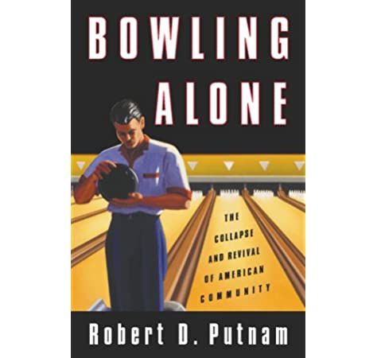
```
]

---
## Otros ejemplos

```{r echo=FALSE,  out.width= '50%', fig.align='center'}
knitr::include_graphics('./files/libro.jpg')
```

---
## Otros ejemplos

```{r echo=FALSE,  out.width= '30%', fig.align='center'}

```


---
class: center, middle, inverse


---
## Principio 2: Vincular la investigación con la teoría relevante.

+ “Las teorías científicas son, en esencia, modelos conceptuales que explican algunos fenómenos. Son especies de redes proyectadas para atrapar lo que llamamos 'el mundo' ... Nuestro esfuerzo es esforzarnos por hacer que la malla de la red sea cada vez más fina” 
(Popper, 1959, p. 59).

+ ¿Que pasa en Psicología?¿Cúal es la relación entre teoría e investigación?

---
## Teoría

- Afecta a qué se observa

- Y a cómo se observa

- Influye en la pregunta de investigación

- En los métodos que se utilizan

- Y en la interpretación de los datos


---
## Principio 3: Usar métodos que permitan la investigación directa de la pregunta.

+ Deber ser seleccionado en función de la pregunta de investigación

+ Debe “encajar” con la pregunta de investigación

+ Se debe justificar por qué se elige dicho método

+ Hay que tener en cuenta las limitaciones

---
## Si una hipótesis es confirmada usando distintos métodos, su credibilidad aumenta.

Comprender las habilidades para lectura

+ Cuestionarios

+ Entrevistas

+ Técnicas de Neuroimagen

---
## Principio 4: Proporcionar una cadena de razonamiento coherente y explícita.


```{r echo=FALSE, out.width= '60%'}
knitr::include_graphics('./files/model1.png')
```
--
¿Es posible pensarlo al revés?

---
## Principio 5: Replicar y generalizar todos los estudios.

.pull_left[
+ Replicación

+ Generalización

+ Reproducibilidad 
]

.pull_right[

```{r echo=FALSE, out.width= '80%'}
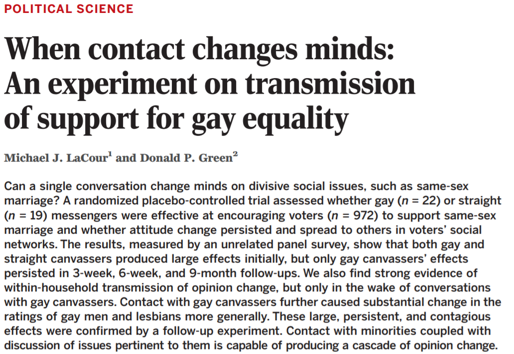
```
]

---
```{r echo=FALSE, out.width= '70%', fig.align='center'}

```

---
```{r echo=FALSE, out.width= '80%', fig.align='center'}
knitr::include_graphics('./files/lacour2.png')
```

---
```{r echo=FALSE, out.width= '55%', fig.align='center'}
knitr::include_graphics('./files/lacour3.png')
```


---
## Principio 6: Desarrollar investigaciones para alentar la reflexión y la crítica profesional

+ Comunidad científica

+ Comunicación de resultados (revisión de pares)

+ Difusión amplia


---
class: center, middle, inverse

## Concepciones del conocimiento

---
## Paradigmas

Leyes, teorías, aplicaciones e instrumentos, que proporcionan modelos que organizan la forma de comprender e investigar la realidad (social).

- Atraen un grupo duradero de partidarios

- Definen métodos y problemas legítimos (reglas y normas para la práctica científica)

---
## Paradigmas

“Los paradigmas alcanzan su posición porque tiene más éxito que sus competidores a la hora de resolver problemas que el grupo de científicos practicantes considera urgente” (Kuhn).

- Modelo ideal del progreso de la ciencia

```{r echo=FALSE, out.width= '80%', fig.align='center'}
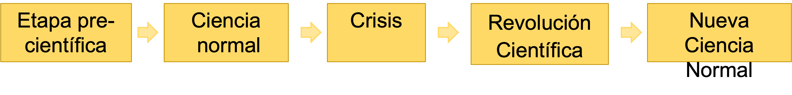
```

---
## Paradigmas

Cada paradigma se basa en una serie de supuestos acerca de:

- La naturaleza de la realidad (Ontologías)

- La (no)neutralidad del investigador (Epistemologías)

- Formas de acceder a la realidad (Metodologías)

---
## Paradigmas

Delimitan los hechos/temas que serán investigados

Presionan a científic@s a hacer que naturaleza/sociedad y teoría lleguen a un acuerdo

Delimitan el tipo de investigación (método) que se seleccionará

```{r echo=FALSE, out.width= '65%', fig.align='center'}
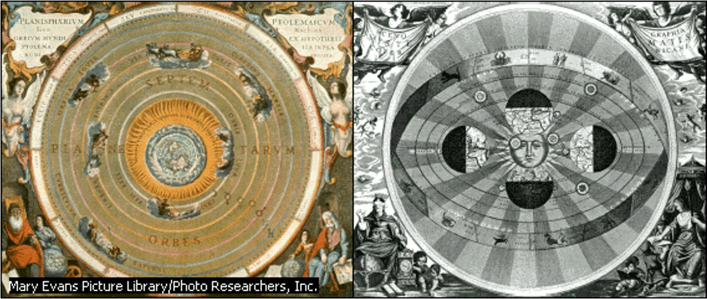
```

---
class: center, middle, inverse
## Paradigmas en Ciencias Sociales

Ciencias sociales pueden ser concebidas como multiparadigmaticas. 

- Positivismo temprano (Circulo de Viena) 

- Post-positivismo (Karl Popper)

- Paradigma del conflicto (o crítico)

- Paradigma Interpretativo

---
## Positivismo temprano (Circulo de Viena) 

- Intento de aplicar los principios de funcionamiento de las Cns. Naturales a las Cns. Sociales.

- Objetivo: explicación, predicción y control del fenómeno estudiado.

- El investigad@r ocupa el rol de experto.

- Opera sobre a base del principio de inducción (de lo particular a lo general).

- El conocimiento se va acumulando.

- Se busca excluir a los valores del proceso de investigación.

- Se basó principalmente en la verificación.


---
## Post-positivismo (Karl Popper)

- Intento de superar las ingenuidades presentes en el positivismo.

- Se sustenta en argumentos de Popper sobre la falsación.

- Opera sobre la base de la deducción (de lo general a lo particular).

- El investigad@r es un experto sometido a constante crítica o evaluación.

- Búsqueda de explicación, predicción y control del fenómeno.

- Se busca estar libre de valores (conocimiento neutro-objetivo).


---
## Paradigma Interpretativo (Constructivismo)

- Objetivo: comprender y reconstruir la construcción de los individuos.

- El conocimiento es una construcción establecido en consenso entre quien investiga y quien es investigado.

- Múltiples conocimientos pueden convivir.

- El investigador es un facilitador, que no busca la transformación y está muy implicado en el proceso de investigación.

- Imposibilidad de separar valores del proceso de investigación.

- Conocimiento no generalizable.


---
## Paradigma del conflicto o crítico (participativo)

- Tiene como objetivo criticar y transformar la realidad.

- El conocimiento consiste en una serie de características estructurales e históricas que serán transformadas según pase el tiempo.

- Las transformaciones son derivadas de un proceso de superación de la ignorancia y la falta de comprensión.

- El investigador juega el rol de instigador y facilitador.

- El investigador es un intelectual transformativo que facilita por medio del conocimiento el proceso de superar la ignorancia

- Imposibilidad de separar valores y hechos.

---
## Pragmatismo (Creswell)

"En lugar de que los métodos sean importantes, lo más importante es el problema, y los investigadores usan todos los enfoques para comprender el problema" (Creswell).

- No está comprometido con algún sistema de filosofía y realidad. 

- Tipicamente aplica métodos mixtos de investigación

- Los investigador@s individuales tienen libertad de opción. Son “libres” para seleccionar los métodos, las técnicas y los procedimientos

- La verdad es lo que funciona en el momento: se trabaja para proporcionar la mejor comprensión de un problema de investigación.

- La investigación ocurre siempre en contextos sociales, históricos, políticos, etc. 

---
## Investigación inductiva y deductiva

```{r echo=FALSE, out.width= '80%', fig.align='center'}
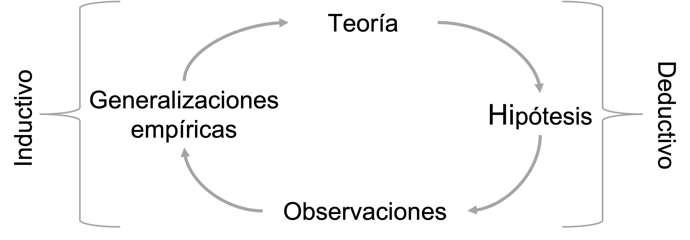
```

---
## Razonamiento inductivo

- Razonamiento que se centra en la creación de declaraciones generalizadas de ejemplos y sucesos específicos.

- Se trabaja a partir de ejemplos concretos que luego se convierten en conceptos generalizados

-   La lógica inductiva se usa básicamente en estudios exploratorios, donde no se conoce mucho del tema de investigación.

---
## Un ejemplo inductivo

```{r echo=FALSE, out.width= '40%', fig.align='center'}
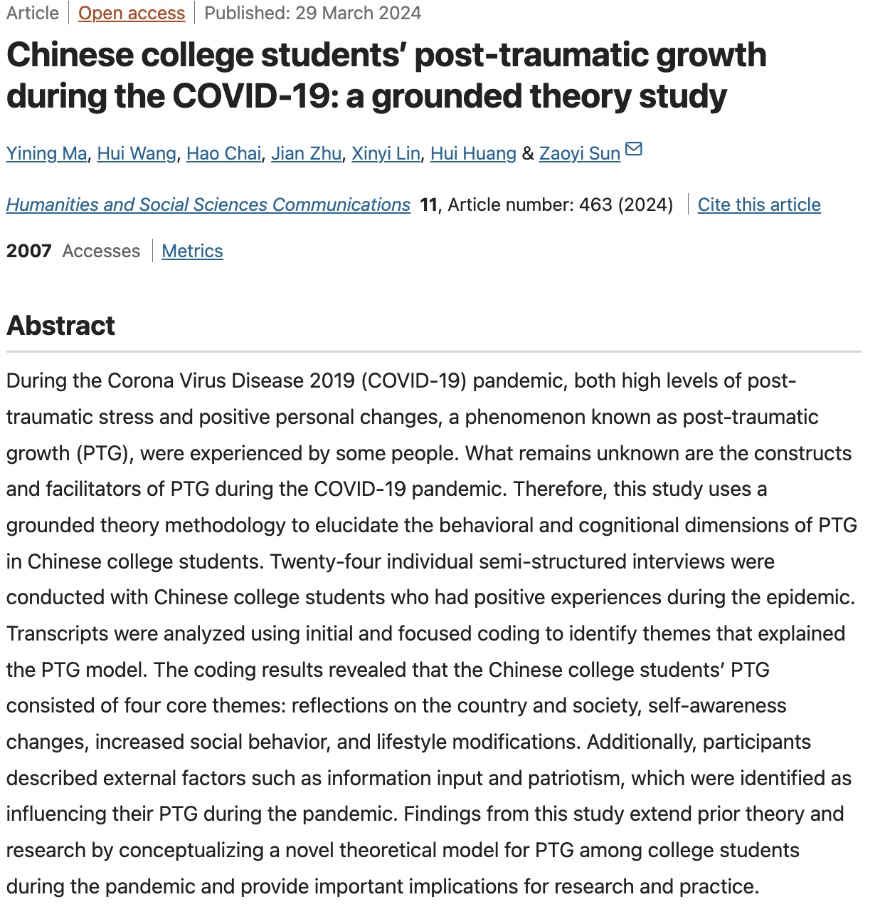
```

---
## Razonamiento deductivo

- Elegir un tema de interés

- Límite el alcance del fenómeno a nivel temporal y geográfico

- Identifique los principales conceptos

- Averigüe (en la literatura) que se sabe con respecto al tema de interés
- Construya hipótesis a partir de lo que haya averiguado

- Testee aquellas hipótesis (si las hay)

---
## Un ejemplo deductivo

```{r echo=FALSE, out.width= '60%', fig.align='center'}
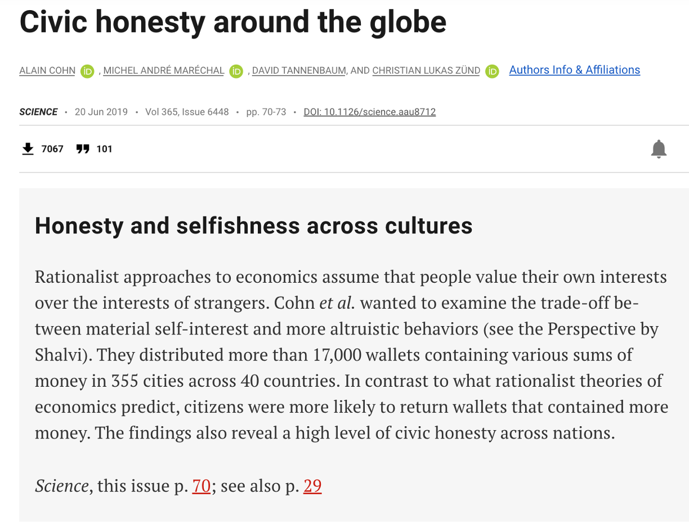
```

---
## Un ejemplo deductivo

```{r echo=FALSE, out.width= '80%', fig.align='center'}
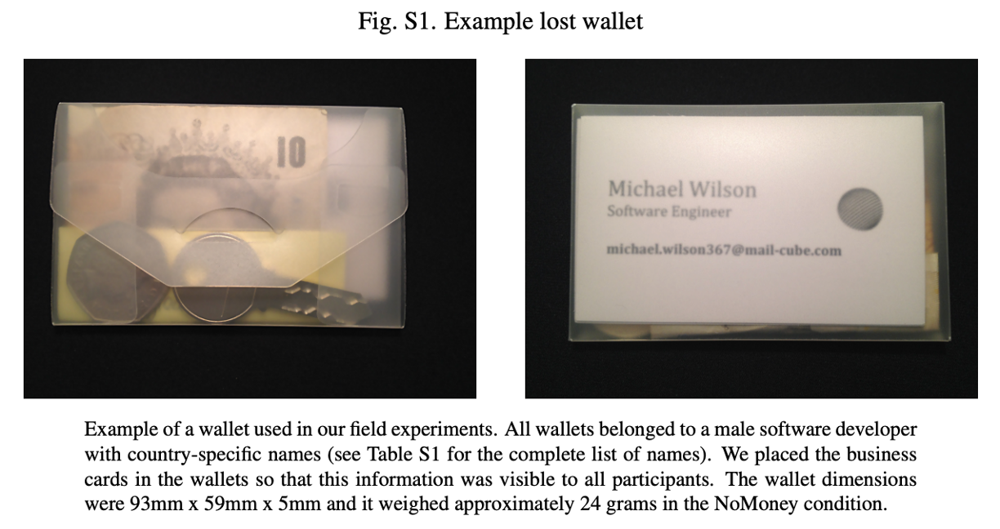
```


---
## Un ejemplo deductivo

```{r echo=FALSE, out.width= '50%', fig.align='center'}
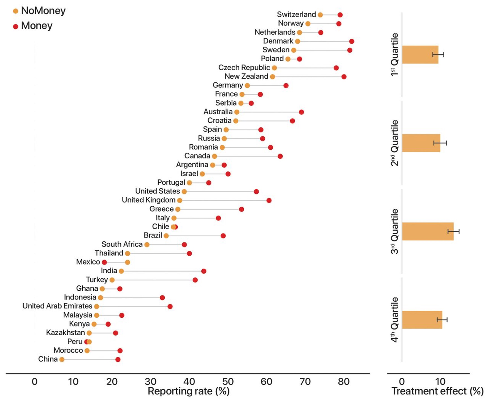
```


---
## Un ejemplo deductivo

```{r echo=FALSE, out.width= '40%', fig.align='center'}
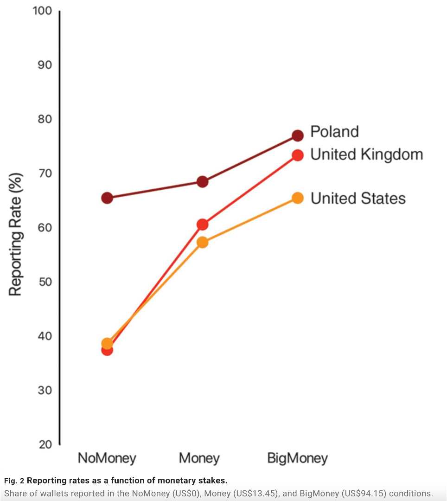
```


---
## Un ejemplo deductivo

```{r echo=FALSE, out.width= '60%', fig.align='center'}
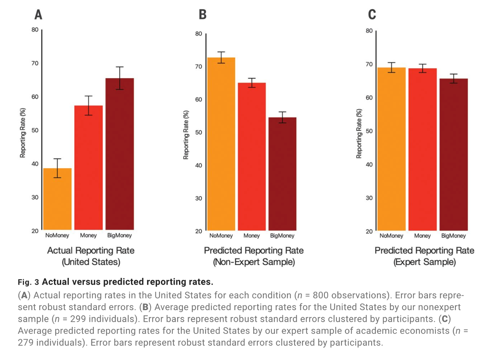
```

---
## Estrategias de indagación

- Cuantitativas

- Cualitativas

- Mixtas

**Volveremos sobre esto más adelante en el curso**

---
## Proceso de Investigación

```{r echo=FALSE, out.width= '110%', fig.align='center'}
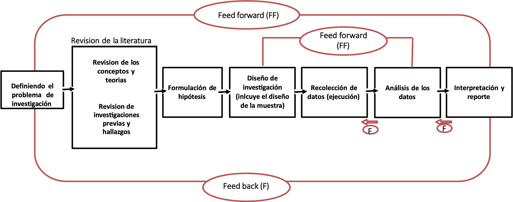
```


---

class: center, middle

### **Muchas Gracias!**


# Metodología de la Investigación Social

Clase 2

##### Daniel Miranda
##### 

<br>

2025

```{r echo=FALSE, out.width = '10%', eval=FALSE}
knitr::include_graphics('./files/mide_logo_2019.png')
```