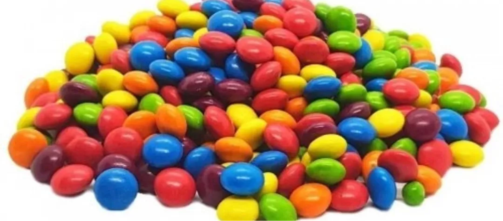

## Ejercicio de muestreo



```{r, echo=FALSE, results='hide'}
pacman::p_load(rio, summarytools, dplyr, ggplot2, ggpubr)

chubis= rio::import("Chubi2026.csv")
names(chubis)

summarytools::dfSummary(chubis, headings=TRUE)

base= chubis %>%
  select(year, seccion, azul_e, cafe_e, verde_e, naranja_e, rojo_e, amarillo_e, total_e, azul, cafe, verde, naranja, rojo, amarillo, total)

names(base)
str(base)

summarytools::dfSummary(base, headings=TRUE)

base %>%
  group_by(year, seccion) %>%
  summarise(sum(total))

```

## Algunos resultados esperados (N=234)

```{r}
 total= base %>%
  group_by(total_e) %>%
  summarise(count=n(), prop=round((count/(length(base$seccion))*100), digits=1)) %>% ggplot(., mapping = aes(x =total_e,
                         y= prop)) +
  geom_bar(stat="identity", fill="black") +
  geom_text(aes(label = prop), vjust = -1, colour = "black", size=2) +
  ylim(c(0,60)) +  # Fijar el eje y
#   xlim(c(0,9)) +  # Fijar el eje x
  #ggtitle("Distribución del azul esperado") +
  xlab("Número de esperados") + ylab("Porcentaje (%)")+
  labs(fill = "Chubis esperado")

total
```

## Resultados esperados (N=234)

```{r}

azul= base %>%
  group_by(azul_e) %>%
  summarise(count=n(), prop=round((count/(length(base$seccion))*100), digits=1)) %>%
 ggplot(., mapping = aes(x =azul_e,
                         y= prop)) +
  geom_bar(stat="identity", fill="blue2") +
  geom_text(aes(label = prop), vjust = -1, colour = "black", size=2) +
  ylim(c(0,100)) +  # Fijar el eje y
   xlim(c(0,9)) +  # Fijar el eje x
  #ggtitle("Distribución del azul esperado") +
  xlab("Proporción de azules esperados") + ylab("Porcentaje (%)")+
  labs(fill = "Azul esperado")

cafe= base %>%
  group_by(cafe_e) %>%
  summarise(count=n(), prop=round((count/(length(base$seccion))*100), digits=1)) %>%
 ggplot(., mapping = aes(x =cafe_e,
                         y= prop)) +
  geom_bar(stat="identity", fill="brown4") +
  geom_text(aes(label = prop), vjust = -1, colour = "black", size=2) +
  ylim(c(0,100)) +  # Fijar el eje y
 xlim(c(0,9)) +  # Fijar el eje x
  #ggtitle("Distribución del azul esperado") +
  xlab("Proporción de café esperados") + ylab("Porcentaje (%)")+
  labs(fill = "Café esperado")


rojo= base %>%
  group_by(rojo_e) %>%
  summarise(count=n(), prop=round((count/(length(base$seccion))*100), digits=1)) %>%
 ggplot(., mapping = aes(x =rojo_e,
                         y= prop)) +
  geom_bar(stat="identity", fill="red") +
  geom_text(aes(label = prop), vjust = -1, colour = "black", size=2) +
  ylim(c(0,100)) +  # Fijar el eje y
   xlim(c(0,9)) +  # Fijar el eje x
  #ggtitle("Distribución del azul esperado") +
  xlab("Proporción de rojos esperados") + ylab("Porcentaje (%)")+
  labs(fill = "Rojo esperado")


amarillo= base %>%
  group_by(amarillo_e) %>%
  summarise(count=n(), prop=round((count/(length(base$seccion))*100), digits=1)) %>%
 ggplot(., mapping = aes(x =amarillo_e,
                         y= prop)) +
  geom_bar(stat="identity", fill="yellow") +
  geom_text(aes(label = prop), vjust = -1, colour = "black", size=2) +
  ylim(c(0,100)) +  # Fijar el eje y
   xlim(c(0,9)) +  # Fijar el eje x
  #ggtitle("Distribución del azul esperado") +
  xlab("Proporción de amarillos esperados") + ylab("Porcentaje (%)")+
  labs(fill = "Amarillo esperado")

naranja= base %>%
  group_by(naranja_e) %>%
  summarise(count=n(), prop=round((count/(length(base$seccion))*100), digits=1)) %>%
 ggplot(., mapping = aes(x =naranja_e,
                         y= prop)) +
  geom_bar(stat="identity", fill="orange") +
  geom_text(aes(label = prop), vjust = -1, colour = "black", size=2) +
  ylim(c(0,100)) +  # Fijar el eje y
   xlim(c(0,9)) +  # Fijar el eje x
  #ggtitle("Distribución del azul esperado") +
  xlab("Proporción de naranjas esperados") + ylab("Porcentaje (%)")+
  labs(fill = "Naranja esperado")

verde= base %>%
  group_by(verde_e) %>%
  summarise(count=n(), prop=round((count/(length(base$seccion))*100), digits=1)) %>%
 ggplot(., mapping = aes(x =verde_e,
                         y= prop)) +
  geom_bar(stat="identity", fill="green1") +
  geom_text(aes(label = prop), vjust = -1, colour = "black", size=2) +
  ylim(c(0,100)) +  # Fijar el eje y
  xlim(c(0,9)) +  # Fijar el eje x
  #ggtitle("Distribución del azul esperado") +
  xlab("Proporción de verdes esperados") + ylab("Porcentaje (%)")+
  labs(fill = "Verde esperado")

ggarrange(azul, verde, rojo, amarillo, cafe, naranja)


```

## Resultados esperados (N=234)

```{r, eval=TRUE, echo=FALSE}
sum=base %>%
  summarise(sum(azul_e), sum(verde_e), sum(rojo_e), sum(amarillo_e), sum(cafe_e), sum(naranja_e))

#sum(975, 840, 970, 846, 463, 810)
count=c(975, 840, 970, 846, 463, 810)
#sum(count)
prop=count/4904
#prop
labels=c("Azul 19,88%","Verde 17,12%","Rojo 19,77%","Amarillo 17,25%","Café 9,44%", "Naranja 16,51%")
pie=data.frame(count, labels)

pie(pie$count, labels = labels, col=c("blue2", "green", "red", "yellow", "brown", "orange"))

```

## Resultados observados en 2026: sección 1

46 muestras pequeñas

924 unidades observadas en sección 1

```{r}
  
 total=base %>%
  filter(seccion==1 & year==2026)%>%
  group_by(total) %>%
  summarise(count=n(), prop=round((count/(length(which(base$seccion==1 & base$year==2026)))*100), digits=1))%>%
 ggplot(., mapping = aes(x =total,
                         y= prop)) +
  geom_bar(stat="identity", fill="black") +
  geom_text(aes(label = prop), vjust = -1, colour = "black", size=2) +
  #ylim(c(0,65)) +  # Fijar el eje y
#   xlim(c(0,9)) +  # Fijar el eje x
  #ggtitle("Distribución del azul esperado") +
  xlab("Número de observados") + ylab("Porcentaje (%)")+
  labs(fill = "Chubis observados")

total

```


## Resultados observados en 2026: sección 1

```{r}

azul=base %>%
  filter(seccion==1 & year==2026)%>%
  group_by(azul)%>% 
  summarise(count=n(), prop=round((count/(length(which(base$seccion==1 & base$year==2026)))*100), digits=1))%>% 
 ggplot(., mapping = aes(x =azul,
                         y= prop)) +
  geom_bar(stat="identity", fill="blue2") +
  geom_text(aes(label = prop), vjust = -1, colour = "black", size=2) +
  ylim(c(0,50)) +  # Fijar el eje y
   xlim(c(1,9)) +  # Fijar el eje x
  #ggtitle("Distribución del azul observado") +
  xlab("Proporción de azules observados") + ylab("Porcentaje (%)")+
  labs(fill = "Azul observado")

cafe= base %>%
  filter(seccion==1 & year==2026)%>%
  group_by(cafe) %>%
  summarise(count=n(), prop=round((count/(length(which(base$seccion==1 & base$year==2026)))*100), digits=1)) %>%
 ggplot(., mapping = aes(x =cafe,
                         y= prop)) +
  geom_bar(stat="identity", fill="brown4") +
  geom_text(aes(label = prop), vjust = -1, colour = "black", size=2) +
  ylim(c(0,50)) +  # Fijar el eje y
   xlim(c(0,9)) +  # Fijar el eje x
  #ggtitle("Distribución del azul observado") +
  xlab("Proporción de café observados") + ylab("Porcentaje (%)")+
  labs(fill = "Café observado")


rojo= base %>%
  filter(seccion==1 & year==2026)%>%
  group_by(rojo) %>%
  summarise(count=n(), prop=round((count/(length(which(base$seccion==1 & base$year==2026)))*100), digits=1)) %>%
 ggplot(., mapping = aes(x =rojo,
                         y= prop)) +
  geom_bar(stat="identity", fill="red") +
  geom_text(aes(label = prop), vjust = -1, colour = "black", size=2) +
  ylim(c(0,50)) +  # Fijar el eje y
   xlim(c(0,9)) +  # Fijar el eje x
  #ggtitle("Distribución del azul observado") +
  xlab("Proporción de rojos observados") + ylab("Porcentaje (%)")+
  labs(fill = "Rojo observado")


amarillo= base %>%
  filter(seccion==1 & year==2026)%>%
  group_by(amarillo) %>%
  summarise(count=n(), prop=round((count/(length(which(base$seccion==1 & base$year==2026)))*100), digits=1)) %>%
 ggplot(., mapping = aes(x =amarillo,
                         y= prop)) +
  geom_bar(stat="identity", fill="yellow") +
  geom_text(aes(label = prop), vjust = -1, colour = "black", size=2) +
  ylim(c(0,50)) +  # Fijar el eje y
   xlim(c(1,9)) +  # Fijar el eje x
  #ggtitle("Distribución del azul observado") +
  xlab("Proporción de amarillos observados") + ylab("Porcentaje (%)")+
  labs(fill = "Amarillo observado")


naranja= base %>%
  filter(seccion==1 & year==2026)%>%
  group_by(naranja) %>%
  summarise(count=n(), prop=round((count/(length(which(base$seccion==1 & base$year==2026)))*100), digits=1)) %>%
 ggplot(., mapping = aes(x =naranja,
                         y= prop)) +
  geom_bar(stat="identity", fill="orange") +
  geom_text(aes(label = prop), vjust = -1, colour = "black", size=2) +
  ylim(c(0,50)) +  # Fijar el eje y
   xlim(c(0,9)) +  # Fijar el eje x
  #ggtitle("Distribución del azul observado") +
  xlab("Proporción de naranjas observados") + ylab("Porcentaje (%)")+
  labs(fill = "Naranja observado")

verde= base %>%
  filter(seccion==1 & year==2026)%>%
  group_by(verde) %>%
  summarise(count=n(), prop=round((count/(length(which(base$seccion==1 & base$year==2026)))*100), digits=1)) %>%
 ggplot(., mapping = aes(x =verde,
                         y= prop)) +
  geom_bar(stat="identity", fill="green1") +
  geom_text(aes(label = prop), vjust = -1, colour = "black", size=2) +
  ylim(c(0,50)) +  # Fijar el eje y
   xlim(c(0,9)) +  # Fijar el eje x
  #ggtitle("Distribución del azul observado") +
  xlab("Proporción de verdes observados") + ylab("Porcentaje (%)")+
  labs(fill = "Verde observado")

ggarrange(azul, verde, rojo, amarillo, cafe, naranja)

```

## Resultados observados en 2026: sección 1

```{r, eval=TRUE, echo=FALSE}
sum=base %>%
  filter(seccion==1 & year==2026)%>%
  summarise(sum(azul), sum(verde), sum(rojo), sum(amarillo), sum(cafe), sum(naranja))

#sum
#sum/2721

count=c(142, 35, 305, 198, 0, 244)
#sum(count)
prop=count/924
#prop
labels=c("Azul 15,36%","Verde 3,78%","Rojo 33,00%","Amarillo 21,42%","Café 0%", "Naranja 26,40%")
pie=data.frame(count, labels)
#pie

#str(pie)
#pie2=(pie/1411)*100
#pie

pie(pie$count, labels = labels, col=c("blue2", "green", "red", "yellow", "brown", "orange"), border="white")


```

## Resultados observados en 2026: sección 2

114 muestras pequeñas

1149 unidades observadas en sección 2

```{r}

 total= base %>%
  filter(seccion==2 & year==2026)%>%
  group_by(total) %>%
  summarise(count=n(), prop=round((count/(length(which(base$seccion==2  & base$year==2026)))*100), digits=1))%>%
 ggplot(., mapping = aes(x =total,
                         y= prop)) +
  geom_bar(stat="identity", fill="black") +
  geom_text(aes(label = prop), vjust = -1, colour = "black", size=2) +
  #ylim(c(0,66)) +  # Fijar el eje y
#   xlim(c(0,9)) +  # Fijar el eje x
  #ggtitle("Distribución del azul esperado") +
  xlab("Número de observados") + ylab("Porcentaje (%)")+
  labs(fill = "Chubis observados")

total

```

## Resultados observados en 2026: sección 2

```{r}

azul= base %>%
  filter(seccion==2 & year==2026)%>%
  group_by(azul) %>%
  summarise(count=n(), prop=round((count/(length(which(base$seccion==2  & base$year==2026)))*100), digits=1)) %>%
 ggplot(., mapping = aes(x =azul,
                         y= prop)) +
  geom_bar(stat="identity", fill="blue2") +
  geom_text(aes(label = prop), vjust = -1, colour = "black", size=2) +
  ylim(c(0,50)) +  # Fijar el eje y
   xlim(c(0,9)) +  # Fijar el eje x
  #ggtitle("Distribución del azul observado") +
  xlab("Proporción de azules observados") + ylab("Porcentaje (%)")+
  labs(fill = "Azul observado")

cafe= base %>%
  filter(seccion==2 & year==2026)%>%
  group_by(cafe) %>%
  summarise(count=n(), prop=round((count/(length(which(base$seccion==2 & base$year==2026)))*100), digits=1)) %>%
 ggplot(., mapping = aes(x =cafe,
                         y= prop)) +
  geom_bar(stat="identity", fill="brown4") +
  geom_text(aes(label = prop), vjust = -1, colour = "black", size=2) +
  ylim(c(0,50)) +  # Fijar el eje y
   xlim(c(0,9)) +  # Fijar el eje x
  #ggtitle("Distribución del azul observado") +
  xlab("Proporción de café observados") + ylab("Porcentaje (%)")+
  labs(fill = "Café observado")


rojo= base %>%
  filter(seccion==2 & year==2026)%>%
  group_by(rojo) %>%
  summarise(count=n(), prop=round((count/(length(which(base$seccion==2 & base$year==2026)))*100), digits=1)) %>%
 ggplot(., mapping = aes(x =rojo,
                         y= prop)) +
  geom_bar(stat="identity", fill="red") +
  geom_text(aes(label = prop), vjust = -1, colour = "black", size=2) +
  ylim(c(0,50)) +  # Fijar el eje y
   xlim(c(0,9)) +  # Fijar el eje x
  #ggtitle("Distribución del azul observado") +
  xlab("Proporción de rojos observados") + ylab("Porcentaje (%)")+
  labs(fill = "Rojo observado")


amarillo= base %>%
  filter(seccion==2 & year==2026)%>%
  group_by(amarillo) %>%
  summarise(count=n(), prop=round((count/(length(which(base$seccion==2 & base$year==2026)))*100), digits=1)) %>%
 ggplot(., mapping = aes(x =amarillo,
                         y= prop)) +
  geom_bar(stat="identity", fill="yellow") +
  geom_text(aes(label = prop), vjust = -1, colour = "black", size=2) +
  ylim(c(0,50)) +  # Fijar el eje y
   xlim(c(0,9)) +  # Fijar el eje x
  #ggtitle("Distribución del azul observado") +
  xlab("Proporción de amarillos observados") + ylab("Porcentaje (%)")+
  labs(fill = "Amarillo observado")


naranja= base %>%
  filter(seccion==2 & year==2026)%>%
  group_by(naranja) %>%
  summarise(count=n(), prop=round((count/(length(which(base$seccion==2 & base$year==2026)))*100), digits=1)) %>%
 ggplot(., mapping = aes(x =naranja,
                         y= prop)) +
  geom_bar(stat="identity", fill="orange") +
  geom_text(aes(label = prop), vjust = -1, colour = "black", size=2) +
  ylim(c(0,50)) +  # Fijar el eje y
   xlim(c(0,9)) +  # Fijar el eje x
  #ggtitle("Distribución del azul observado") +
  xlab("Proporción de naranjas observados") + ylab("Porcentaje (%)")+
  labs(fill = "Naranja observado")

verde= base %>%
  filter(seccion==2 & year==2026)%>%
  group_by(verde) %>%
  summarise(count=n(), prop=round((count/(length(which(base$seccion==2 & base$year==2026)))*100), digits=1)) %>%
 ggplot(., mapping = aes(x =verde,
                         y= prop)) +
  geom_bar(stat="identity", fill="green1") +
  geom_text(aes(label = prop), vjust = -1, colour = "black", size=2) +
  ylim(c(0,50)) +  # Fijar el eje y
   xlim(c(0,9)) +  # Fijar el eje x
  #ggtitle("Distribución del azul observado") +
  xlab("Proporción de verdes observados") + ylab("Porcentaje (%)")+
  labs(fill = "Verde observado")

ggarrange(azul, verde, rojo, amarillo, cafe, naranja)

```

## Resultados observados en 2026: sección 2

```{r, eval=TRUE, echo=FALSE}
sum=base %>%
  filter(seccion==2 & year==2026)%>%
  summarise(sum(azul), sum(verde), sum(rojo), sum(amarillo), sum(cafe), sum(naranja))

#sum


count=c(175, 66, 362, 224, 4, 318)
#sum(count)
prop=count/1149
#prop
labels=c("Azul 17,45%","Verde 19,08%","Rojo 18,34%","Amarillo 32,98%","Café 0,00%", "Naranja 12,13%")
pie=data.frame(count, labels)
#pie

#str(pie)
#pie2=(pie/1411)*100
#pie

pie(pie$count, labels = labels, col=c("blue2", "green", "red", "yellow", "brown", "orange"), border="white")


```

## Resultados globales observados en 2025

130 muestras pequeñas

1149 unidades observadas

```{r}
 total= base %>%
  filter(year==2025)%>%
  group_by(total) %>%
  summarise(count=n(), prop=round((count/(length(which(base$year==2026)))*100), digits=1))%>%
 ggplot(., mapping = aes(x =total,
                         y= prop)) +
  geom_bar(stat="identity", fill="black") +
  geom_text(aes(label = prop), vjust = -1, colour = "black", size=2) +
  #ylim(c(0,65)) +  # Fijar el eje y
#   xlim(c(0,9)) +  # Fijar el eje x
  #ggtitle("Distribución del azul esperado") +
  xlab("Número de observados") + ylab("Porcentaje (%)")+
  labs(fill = "Chibis observados")

total

```

## Resultados globales observados en 2025

```{r}

azul= base %>%
  group_by(azul) %>%
  summarise(count=n(), prop=round((count/(length(base$seccion))*100), digits=1)) %>%
 ggplot(., mapping = aes(x =azul,
                         y= prop)) +
  geom_bar(stat="identity", fill="blue2") +
  geom_text(aes(label = prop), vjust = -1, colour = "black", size=2) +
  ylim(c(0,50)) +  # Fijar el eje y
   xlim(c(0,9)) +  # Fijar el eje x
  #ggtitle("Distribución del azul observado") +
  xlab("Proporción de azules observados") + ylab("Porcentaje (%)")+
  labs(fill = "Azul observado")

cafe= base %>%
  group_by(cafe) %>%
  summarise(count=n(), prop=round((count/(length(base$seccion))*100), digits=1)) %>%
 ggplot(., mapping = aes(x =cafe,
                         y= prop)) +
  geom_bar(stat="identity", fill="brown4") +
  geom_text(aes(label = prop), vjust = -1, colour = "black", size=2) +
  ylim(c(0,50)) +  # Fijar el eje y
   xlim(c(0,9)) +  # Fijar el eje x
  #ggtitle("Distribución del azul observado") +
  xlab("Proporción de café observados") + ylab("Porcentaje (%)")+
  labs(fill = "Café observado")


rojo= base %>%
  group_by(rojo) %>%
  summarise(count=n(), prop=round((count/(length(base$seccion))*100), digits=1)) %>%
 ggplot(., mapping = aes(x =rojo,
                         y= prop)) +
  geom_bar(stat="identity", fill="red") +
  geom_text(aes(label = prop), vjust = -1, colour = "black", size=2) +
  ylim(c(0,50)) +  # Fijar el eje y
   xlim(c(0,9)) +  # Fijar el eje x
  #ggtitle("Distribución del azul observado") +
  xlab("Proporción de rojos observados") + ylab("Porcentaje (%)")+
  labs(fill = "Rojo observado")


amarillo= base %>%
  group_by(amarillo) %>%
  summarise(count=n(), prop=round((count/(length(base$seccion))*100), digits=1)) %>%
 ggplot(., mapping = aes(x =amarillo,
                         y= prop)) +
  geom_bar(stat="identity", fill="yellow") +
  geom_text(aes(label = prop), vjust = -1, colour = "black", size=2) +
  ylim(c(0,50)) +  # Fijar el eje y
   xlim(c(0,9)) +  # Fijar el eje x
  #ggtitle("Distribución del azul observado") +
  xlab("Proporción de amarillos observados") + ylab("Porcentaje (%)")+
  labs(fill = "Amarillo observado")


naranja= base %>%
  group_by(naranja) %>%
  summarise(count=n(), prop=round((count/(length(base$seccion))*100), digits=1)) %>%
 ggplot(., mapping = aes(x =naranja,
                         y= prop)) +
  geom_bar(stat="identity", fill="orange") +
  geom_text(aes(label = prop), vjust = -1, colour = "black", size=2) +
  ylim(c(0,50)) +  # Fijar el eje y
   xlim(c(0,9)) +  # Fijar el eje x
  #ggtitle("Distribución del azul observado") +
  xlab("Proporción de naranjas observados") + ylab("Porcentaje (%)")+
  labs(fill = "Naranja observado")

verde= base %>%
  group_by(verde) %>%
  summarise(count=n(), prop=round((count/(length(base$seccion))*100), digits=1)) %>%
 ggplot(., mapping = aes(x =verde,
                         y= prop)) +
  geom_bar(stat="identity", fill="green1") +
  geom_text(aes(label = prop), vjust = -1, colour = "black", size=2) +
  ylim(c(0,50)) +  # Fijar el eje y
   xlim(c(0,9)) +  # Fijar el eje x
  #ggtitle("Distribución del azul observado") +
  xlab("Proporción de verdes observados") + ylab("Porcentaje (%)")+
  labs(fill = "Verde observado")

ggarrange(azul, verde, rojo, amarillo, cafe, naranja)

```

## Resultados globales observados en 2025

2756 observaciones

```{r, eval=TRUE, echo=FALSE}
sum=base %>%
  filter(base$year==2025)%>%
  summarise(sum(azul), sum(verde), sum(rojo), sum(amarillo), sum(cafe), sum(naranja))

#sum
#513+493+526+874+9+341
count=c(513,493,526,874,9,341)
#sum(count)
prop=count/sum(count)
#prop
labels=c("Azul 19,75%","Verde 16,73%","Rojo 19,82%","Amarillo 30,60%","Café 0,005%", "Naranja 12,57%")
pie=data.frame(count, labels)
#pie

#str(pie)
#pie2=(pie/1411)*100
#pie

pie(pie$count, labels = labels, col=c("blue2", "green", "red", "yellow", "brown", "orange"), border="white")


```

## ¿Qué podemos decir de este ejercicio?

-   ¿Qué diferencia observa entre muestras pequeñas (21 chubis) vs muestras grandes?

-   ¿Qué distancia observamos entre los valores esperados vs los valores observados?

    -   Casi no hay café

    -   El amarillo es un color mucho más frecuente

-   ¿Qué pasó el año anterior?

-   ¿Tiene esto algún paralelo con investigación sobre fenómenos sociales?
